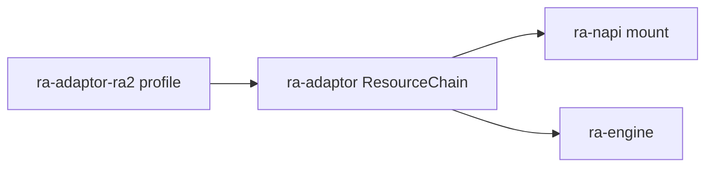
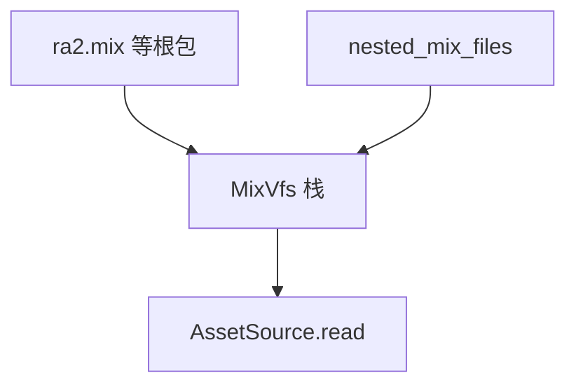
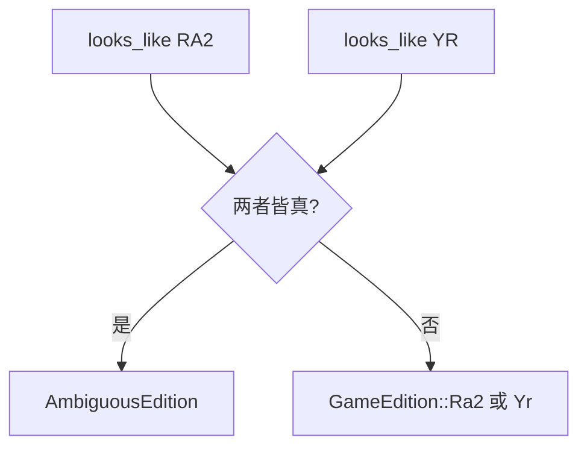

# ra-adaptor-ra2

原版《命令与征服：红色警戒 2》的 **磁盘旁与启动期资源表**。本 crate 几乎全是 **静态数据**：一个 `lib.rs`、无子模块、无运行时逻辑。消费方是
**`ra-adaptor`**（映射成 `ResourceChain`），桌面 **不**直接依赖本包。

差异优先当数据：文件名清单与 `looks_like` 启发式在此维护；编排、歧义消歧、规则装载在 `ra-adaptor`；对局仿真在 **
`ra-engine`**。



## `ResourceProfile`

```rust
pub struct ResourceProfile {
    pub edition: GameEdition,              // 固定 Ra2
    pub root_mix_files: &'static [&'static str],
    pub nested_mix_files: &'static [&'static str],
    pub rules_ini: &'static str,
    pub art_ini: &'static str,
    pub ui_ini: &'static str,
    pub sound_ini: &'static str,
    pub exe_name: &'static str,
}
```

注释：「某一版本期望的文件清单（差异优先当数据）。」

- **根 MIX**：安装根目录旁，启动时 `mount_bytes`；文件名大小写不敏感匹配（`find_ci_file`）。
- **嵌套 MIX**：位于主 MIX 内，启动后 `mount_nested` 按需挂载。
- **INI**：逻辑路径，经 `AssetSource` 读取；当前 `load_rules_chain` 使用 rules + art。
- **`exe_name`**：布局特征名；引擎是自有 GUI（ **`rust-ra2` / `rust-ra2.exe`**）， **不启动**原版 `game.exe`。

结构与 `ra-adaptor-yuri::ResourceProfile` **同形但各自定义**，避免 adaptor 编排层与 profile crate 循环依赖。

## `profile()` 清单

### 根目录 MIX（`root_mix_files`）

| 文件名         | 启动链角色（简述） |
|----------------|--------------------|
| `language.mix` | 语言 / 本地化      |
| `ra2.mix`      | 原版主内容包       |
| `multi.mix`    | 多人相关           |
| `theme.mix`    | 主题 / 音乐        |
| `maps01.mix`   | 地图包 1           |
| `maps02.mix`   | 地图包 2           |

`detect_edition` 扫描这些名是否在安装根存在，填入 `EditionManifest.present_mixes` / `missing_mixes`。缺盘计数进入桌面
`boot_note`；是否阻断开窗由壳层决定。

### 嵌套 MIX（`nested_mix_files`）

| 文件名        |
|---------------|
| `local.mix`   |
| `cache.mix`   |
| `conquer.mix` |
| `generic.mix` |
| `isogen.mix`  |
| `cameo.mix`   |
| `audio.mix`   |

桌面在根包 `mount_bytes` 成功后，对本列表逐个 `MixVfs::mount_nested`。挂载顺序影响「先挂载者优先」overlay（见
`ra-assets::MixVfs`）。



### INI 与 exe

| 字段        | 值          |
|-------------|-------------|
| `rules_ini` | `rules.ini` |
| `art_ini`   | `art.ini`   |
| `ui_ini`    | `ui.ini`    |
| `sound_ini` | `sound.ini` |
| `exe_name`  | `game.exe`  |

`RulesDb` 经 `ra-adaptor::load_rules_chain` 读取 rules + art 并派生 techno / overlay 等表，供 **
`ra-engine::open_skirmish_session`** 使用。`ui.ini` / `sound.ini` 已在表中，加载器尚未消费——预留扩展位。

## `looks_like`

```rust
pub fn looks_like(root: &Path) -> bool {
    root.join("game.exe").is_file()
        || root.join("rules.ini").is_file()
        || root.join("ra2.mix").is_file()
        || root.join("language.mix").is_file()
}
```

任意一条为真即判「像原版」。这是 **OR 启发式**，不是完整性证明：

- 只剩残缺 `language.mix` 也可能判真。
- 与 YR 目录混装时两边都可能真 → `ra-adaptor` 报 `AmbiguousEdition`。
- 大小写敏感文件系统上磁盘可能是 `RA2.MIX`；此处直拼可能判假，挂载阶段会用 `find_ci_file` 纠正。

自动探测不可靠时，在 `RustAlert.toml` 写 `edition = "ra2"`。



## 与尤里的复仇表对照

不要在本文件复制 YR 列表。对照时打开 `ra-adaptor-yuri`：

- 根包多为 `*md*` 命名。
- 嵌套含 `expandmd01`–`03` 等。
- INI 带 `md` 后缀，`exe_name` 为 `gamemd.exe`。

改原版表时自问：YR 是否有对称项？两边 `looks_like` 是否仍能分开？`ResourceChain::for_edition(Ra2)` 是否仍指向本
`profile()`？

## 依赖与边界

- **依赖**：仅 `ra-types`（`GameEdition`）。
- **不依赖**：`ra-engine`、`ra-assets`、`ra-napi`。
- **被依赖**：`ra-adaptor` 在 `ResourceChain::for_edition(Ra2)` 时调用 `profile()`。

本 crate **不**解析 MIX 内容、 **不**装载规则、 **不**推进 tick——只做 RA2 版的「文件名真相表」。

## 构建与验证

```shell
cargo build -p ra-adaptor-ra2
```

无测试、无 feature。修改 `profile()` 或 `looks_like` 后，请在真实原版目录上运行：

```shell
pnpm exec ra2 launch --path "C:/path/to/ra2"
pnpm exec ra2 extract --path "C:/path/to/ra2" --out ./tmp/extract -- rules.ini
pnpm exec ra2 unpack --path "C:/path/to/ra2" --out ./tmp/unpack
```

确认根 MIX 扫描计数、嵌套挂载数合理，且 `extract`/`unpack` 能读到预期资源。

## 许可

Apache-2.0。表里是文件名，不是资源内容；原版 MIX 不得进入本仓库 git 历史。
