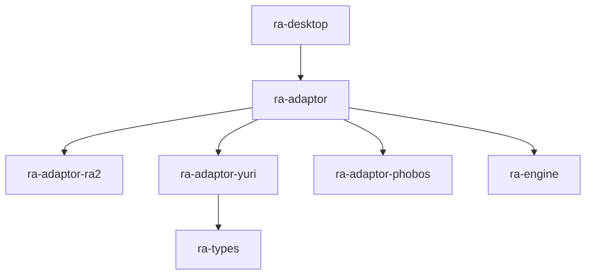
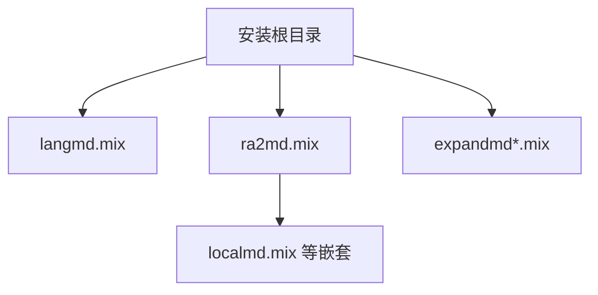

# ra-adaptor-yuri

`ra-adaptor-yuri` 描述**尤里的复仇（Yuri's Revenge）**安装环境的资源表与目录探测启发式。它提供 `ResourceProfile`（与
`ra-adaptor-ra2` 同形）和 `looks_like`，供上层 `ra-adaptor` 组合装配 `ResourceChain`，并在桌面启动时选择正确的 MIX 文件名与
INI 名。

本 crate **不**打开 MIX、不解析 INI、不启动 `gamemd.exe`。它只回答「YR 盘根目录旁通常有哪些文件名、如何判断目录像不像 YR」。

## 它是什么

RA2 现代化重写通过 **adaptor 分层**支持多个官方/社区内容环境。每个环境一个轻量 crate，只依赖 `ra-types`，导出：

- 静态 **`ResourceProfile`**：根目录 MIX 列表、嵌套 MIX 名、rules/art/ui/sound INI 文件名、特征 exe 名；
- **`looks_like(root)`**：基于文件存在的启发式，供自动探测。

尤里复仇在文件名上与原版 RA2 差异显著：`ra2md.mix`、`rulesmd.ini`、`gamemd.exe` 等。把这些知识集中在本 crate，可避免
`ra-adaptor` 主 crate 膨胀，也避免与 `ra-adaptor-ra2` 循环依赖——因此 `ResourceProfile` 在两边 **故意重复定义**，由
`ra-adaptor` 私有映射函数抄入统一的 `ResourceChain`。


**Non-goals**：不处理 Phobos / 心灵终结布局（见 `ra-adaptor-phobos`）；不合并 Mod 自定义路径；不验证 MIX 内部索引完整性。

## 在仓库中的位置



探测状态机（简化）在 `ra-adaptor` 中实现：

- 用户显式 `edition`（来自 `ra-config`） **优先**于启发式；
- 否则比较 `looks_like(RA2)` 与 `looks_like(YR)`；
- 二者皆真 → `AmbiguousEdition`，需用户配置；
- 仅 YR → `GameEdition::Yr` → 本 crate 的 `profile()`。

仿真与命令仍在 **`ra-engine`**。本 crate 仅影响 **开局前**装哪套文件名。

## 如何使用

### 获取 YR 资源表

```rust
use ra_adaptor_yuri::profile;

let p = profile();
assert_eq!(p.exe_name, "gamemd.exe");
assert_eq!(p.rules_ini, "rulesmd.ini");
// p.root_mix_files — 根旁主 MIX 静态列表
// p.nested_mix_files — 常见嵌套名
```

`ra-adaptor` 内部调用 `ResourceChain::from_yr(ra_adaptor_yuri::profile())`，应用开发者通常 **直接** `use ra_adaptor_yuri`
即可，除非你在编写新的编排工具。

### 目录探测

```rust
use ra_adaptor_yuri::looks_like;
use std::path::Path;

let root = Path::new("D:/Games/YR");
if looks_like(root) {
    // 候选 YR；仍需与 RA2 探测结果合并判断
}
```

命中条件（任一即可）：

- 存在 `gamemd.exe`
- 存在 `rulesmd.ini`
- 存在 `ra2md.mix`
- 存在 `langmd.mix`

仅检查路径是否存在，不读取内容。合集盘可能同时存在 RA2 与 YR 文件，因此必须支持显式 `edition = "yr"`。

### 依赖声明

```toml
[dependencies]
ra-adaptor-yuri = { workspace = true }
ra-types = { workspace = true }
```

一般仅 `ra-adaptor` 依赖本 crate；桌面程序通过 `ra-adaptor` 间接使用。

## 内部设计

### `ResourceProfile` 字段

| 字段               | YR 典型值                       | 说明                         |
|--------------------|---------------------------------|------------------------------|
| `edition`          | `GameEdition::Yr`               | 枚举标识                     |
| `root_mix_files`   | `langmd.mix`, `ra2md.mix`, …    | 安装根旁期望文件             |
| `nested_mix_files` | `localmd.mix`, `cachemd.mix`, … | 主 MIX 内常见嵌套            |
| `rules_ini`        | `rulesmd.ini`                   | 规则 INI                     |
| `art_ini`          | `artmd.ini`                     | 美术 INI                     |
| `ui_ini`           | `uimd.ini`                      | UI INI                       |
| `sound_ini`        | `soundmd.ini`                   | 音效 INI                     |
| `exe_name`         | `gamemd.exe`                    | 布局特征，引擎不启动原版 exe |

`root_mix_files` 包含 `multi.mix`、`maps01.mix` 等，以覆盖 **合集安装**仍保留原版地图包、供多人图名复用的常见布局。缺失项由
`ra-adaptor` 扫描时列入 `EditionManifest::missing_mixes`，是否阻止启动由壳层策略决定。



### 与 `ra-adaptor-ra2` 的同形设计

两个 profile crate 定义相同的 `ResourceProfile` 结构体，而非共享 trait crate，是为了 **打断循环依赖**：`ra-adaptor`
依赖两者，但两者之间无依赖。新增字段时需同步两处结构体与 `ra-adaptor` 映射代码——这是刻意的简单性代价。

### 扩展与维护

官方或合集布局若新增 MIX 包名，在本 crate 的静态列表中追加，并补充 `looks_like` 探测键（若具有唯一性）。不要在本 crate 写 Mod
特例；社区扩展布局应通过 Phobos adaptor 或未来专用 profile 处理。

单元测试可构造临时目录并 `touch` 特征文件，验证 `looks_like` 真值表。

## 构建与测试

```shell
cargo check -p ra-adaptor-yuri
cargo test -p ra-adaptor-yuri
```

Workspace：

```shell
cargo check --workspace
```

集成场景：`ra-adaptor` 的 edition 探测测试、桌面启动日志中的 `present_mixes` / `missing_mixes` 计数。

## 许可证

本 crate 采用 **Apache-2.0**。资源文件名来自尤里的复仇公开安装布局的常见约定；使用本表驱动装载时，请确保你拥有合法游戏内容副本。
