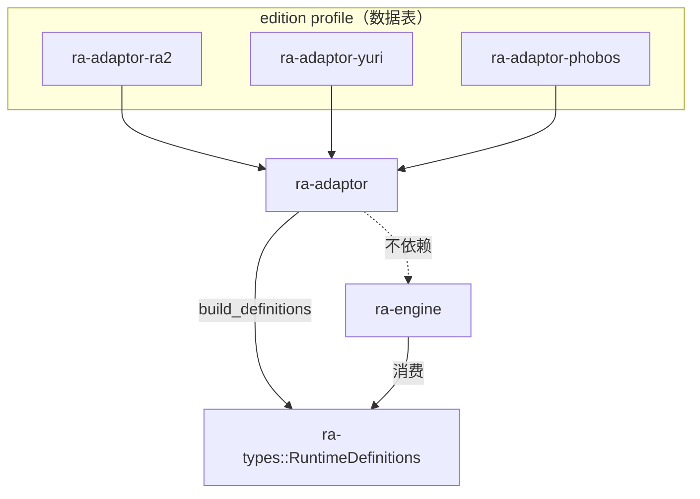
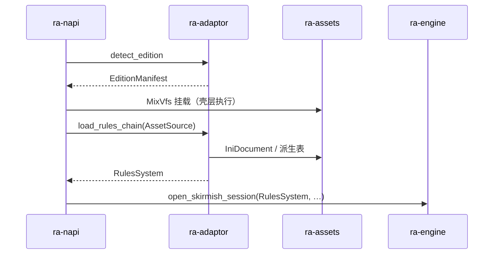
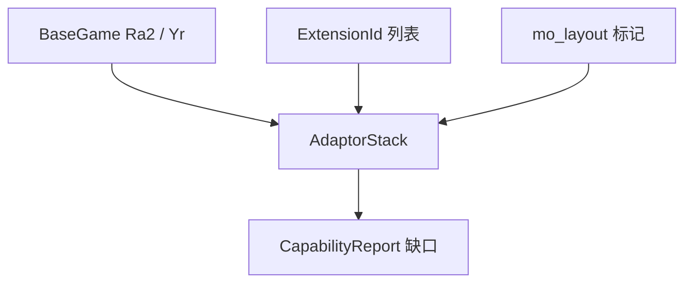

# ra-adaptor

本 crate 负责 **按安装布局识别游戏版本、组合扩展能力、装配统一资源表，并按资源链装载规则数据库**。它是内容进入 **
`ra-engine`** 之前的编排层：把磁盘上的 MIX 与 INI 文件名映射成可执行的 `ResourceChain` 与 `RulesSystem`，再交给桌面壳挂载与开局。

**硬边界**：本 crate **不依赖** `ra-engine`，也不持有对局 tick 或实体状态。冻结的运行时定义契约经 **`ra-types::RuntimeDefinitions`**
单向流入引擎；adaptor 只产出规则快照与版本元数据，不参与仿真推进。



## 在仓库中的位置

桌面启动时，adaptor 位于「配置目录」与「字节解析器」之间：



- **本层做**：版本消歧、`ResourceChain` 装配、根 MIX 存在性扫描、大小写不敏感路径查找、规则 INI 装载。
- **本层不做**：打开 MIX 索引（除通过 `AssetSource` 读已挂载字节）、解析 SHP/TMP、推进 World tick、创建 GPU 设备。

依赖：`ra-types`、`ra-assets`、`ra-adaptor-ra2`、`ra-adaptor-yuri`、`ra-adaptor-phobos`。

## 版本探测：`detect_edition`

```text
root 不是目录？ → Io("游戏目录不存在")
有显式 GameEdition？ → 直接使用
否则启发式：
  looks_like(YR) × looks_like(RA2)
  (true, false)  → Ra2
  (false, true)  → Yr
  (true, true)   → AmbiguousEdition
  (false, false) → CannotDetectEdition
然后：
  ResourceChain::for_edition(edition)
  扫描 root_mix_files → present_mixes / missing_mixes
  组装 EditionManifest
```

显式 `edition` 配置优先于启发式。混装目录（既有 `game.exe` 又有 `gamemd.exe`）必须在配置中写明版本，否则启动失败——这是刻意行为。若命中心灵终结
3 布局启发式，优先 `Mo3`，不再与原版/YR 报歧义。

`scan_root_mixes` 只用 `find_ci_file` 检查文件是否存在， **不打开 MIX、不验证索引**。嵌套包名列在 `nested_mix_files`，实际
`mount_nested` 由 `ra-napi` 在 boot 阶段执行。

## `ResourceChain`

统一资源表视图，字段均为 `'static` 字符串切片：

| 字段                                             | 含义                                       |
|--------------------------------------------------|--------------------------------------------|
| `edition`                                        | `GameEdition`                              |
| `root_mix_files`                                 | 安装根旁主 MIX 名列表                      |
| `nested_mix_files`                               | 主 MIX 内常见嵌套名                        |
| `rules_ini` / `art_ini` / `ui_ini` / `sound_ini` | INI 逻辑路径                               |
| `exe_name`                                       | 布局特征用的主程序名（引擎不启动原版 exe） |

`ResourceChain::for_edition` 内部委托各 profile：

- `Ra2` → `ra_adaptor_ra2::profile()`
- `Yr` → `ra_adaptor_yuri::profile()`
- `Mo3` → `ra_adaptor_phobos::mo_layout_profile()`

各 edition 的 `ResourceProfile` 类型 **同形但分别定义**，避免 adaptor 编排层与 profile crate 形成循环依赖；映射函数
`from_ra2` / `from_yr` / `from_phobos` 将静态表抄入 `ResourceChain`。

## `RulesSystem` 与规则装载

`RulesSystem` 是一局启动用的规则快照：

| 字段            | 来源                     |
|-----------------|--------------------------|
| `rules` / `art` | `IniDocument` 解析       |
| `overlay_types` | 从 rules 派生            |
| `color_schemes` | 从 rules 派生            |
| `techno_types`  | 从 rules 派生            |
| `warheads`      | 从 techno 主武器引用派生 |


- **`load_rules_chain(source, chain)`**：显式资源链入口，适配组合装配后的调用方。
- **`load_rules(source, edition)`**：兼容旧 API，内部先 `ResourceChain::for_edition` 再调用 `load_rules_chain`。

遭遇战开局由 `ra-engine::open_skirmish_session` 消费 `RulesSystem` 与地图信息；adaptor 本身不构造 `World`。

## 可组合适配栈

`compose` 模块引入 **`AdaptorStack`**：基础游戏环境（`BaseGame::Ra2 | Yr`）与扩展能力（`ExtensionId::Ares | Phobos | Kratos`
）正交组合。心灵终结 3 等内容布局归入 Phobos 扩展下的 `mo_layout` 标记，而非独立的第三游戏轴。



`CapabilityReport` 记录已探测但引擎尚未实现的能力（如某扩展特性）， **不得静默忽略**。`AdaptorStack::from_edition` 可从历史互斥
`GameEdition` 推导初始栈；`to_edition` 在扩展细节不完全保留时映射回当前仍在用的枚举值。

冻结定义与 adaptor 输出的衔接经 **`ra-types::RuntimeDefinitions`**：`RulesSystem` 中的 techno / overlay 等投影最终会收敛为引擎消费的不可变契约，避免引擎反向引用
adaptor 内部类型。

## `EditionManifest` 与 `find_ci_file`

```rust
pub struct EditionManifest {
    pub root: PathBuf,
    pub chain: ResourceChain,
    pub present_mixes: Vec<String>,
    pub missing_mixes: Vec<String>,
}
```

桌面启动日志里的「缺盘 N」来自 `missing_mixes.len()`。缺盘不一定阻止开窗——那是壳层策略；本层只报告扫描结果。

`find_ci_file(root, wanted)` 大小写不敏感查找实际磁盘路径：先直拼路径，再 `read_dir` 逐条 ASCII 小写比较。Windows
通常不敏感，但跨平台与网络盘需要此助手；`GameAssetSource` 读松散文件时同样使用。

## 与 profile crate 的分工

| Crate               | 职责                                          |
|---------------------|-----------------------------------------------|
| `ra-adaptor-ra2`    | 原版静态表 + `looks_like`                     |
| `ra-adaptor-yuri`   | 尤里的复仇静态表 + `looks_like`               |
| `ra-adaptor-phobos` | Phobos / MO 布局静态表 + `looks_like`         |
| **本 crate**        | 消歧、装配、扫描、CI 查找、规则装载、扩展组合 |

本层是 adaptor 家族中 **唯一直接使用 `std::fs`** 的 crate（`is_dir` / `read_dir` / `is_file`），但仍不解析 MIX/SHP
二进制内容——解析在 `ra-assets`。

## 构建与验证

```shell
cargo build -p ra-adaptor
```

无单元测试、无 feature 开关。真实目录验证请用：

```shell
pnpm exec ra2 launch --path "C:/Games/RA2"
pnpm exec ra2 extract --path "C:/Games/RA2" --out ./tmp/extract -- rules.ini art.ini
pnpm exec ra2 unpack --path "C:/Games/RA2" --out ./tmp/unpack
```

典型调用链：

```text
DesktopConfig → GameEdition::parse(可选)
→ detect_edition(root, explicit)
→ mount_bytes / mount_nested（壳层）
→ load_rules_chain → RulesSystem
→ open_skirmish_session（ra-engine）
```

## 许可

Apache-2.0。玩家自备游戏目录；本仓库不含 MIX / INI 二进制内容。
