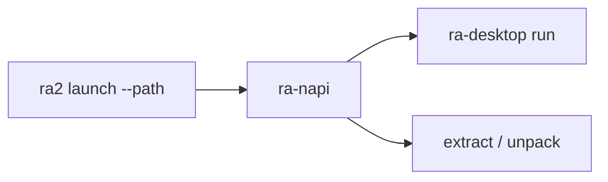

# ra-napi

N-API 绑定 crate（`projects/bindings/ra-napi`）。供 npm 包 **`@game-gpt/red-alert2`** 在 Node 侧加载，对外暴露 `version` / `launch` / `extract` / `unpack`。

本 crate 产出动态库（`cdylib`），**不是**独立 GUI 入口。原生窗口与事件循环在 `ra-desktop`；本库只做参数校验、路径覆盖注入，再调用 `ra_desktop::run` 或资源导出 API。



## 构建

```shell
pnpm run build:napi
```

产物由 `scripts/build/napi.mjs` 写入平台包目录，再由 `@game-gpt/red-alert2` 整合。

## 调用约定

合集盘 / 混装安装目录启动或导出资源时须显式指定版本，例如：

```shell
pnpm exec ra2 launch --path "C:/Games/RA2" --edition ra2
pnpm exec ra2 extract --path "C:/Games/RA2" --edition ra2 --out ./tmp/extract -- sdtp.shp
pnpm exec ra2 unpack --path "C:/Games/RA2" --edition ra2 --out ./tmp/unpack
```

省略 `--edition` 时，适配层可能落到资料片资源链。
