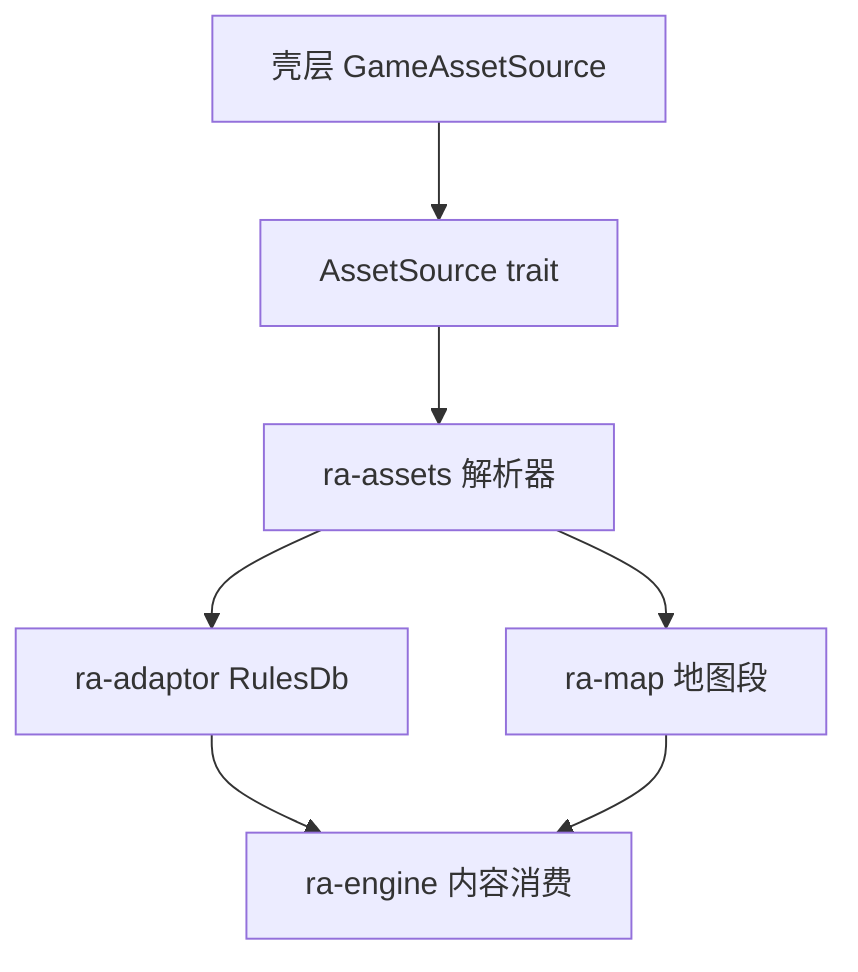
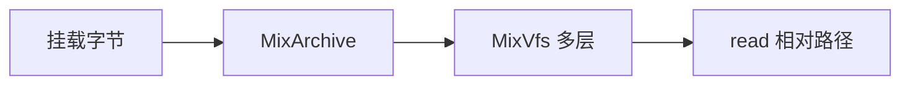
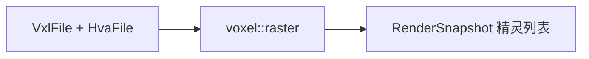

# ra-assets

本 crate 是工作区的 **格式解析层**： **字节进、结构出**。Westwood MIX 档案、INI 配置、调色板、SHP 精灵、TMP 地形砖、VXL 体素与
HVA 动画段等，均在此解码为 Rust 类型。上层 crate（`ra-adaptor`、`ra-map`、 **`ra-engine`** 的内容引导）通过 `AssetSource`
传入相对路径的字节，本库 **不碰 `std::fs`**，也不做安装目录发现。

设计原则：I/O 边界留在壳层；解析器只看见 `Vec<u8>`。这样原生桌面与未来的 Wasm 壳可共用同一套解码逻辑。



## 模块概览

按格式族分目录（字节 → 结构）；`lib.rs` 仍扁平再导出，下游继续 `use ra_assets::…`。

```text
src/
  lib.rs                 扁平再导出
  mix/                   MIX：hash / crypto / archive / vfs
  ini/                   INI 文档模型
  image/                 PAL、SHP、TMP
  voxel/                 VXL、HVA、VPL、预览光栅
  rules/                 rules/art 派生注册表（techno / overlay / warhead / …）
```

依赖：`ra-types`、`blowfish`、`byteorder`、`num-bigint`。

## MIX：哈希、解密与虚拟文件系统

### 名称哈希（`mix/hash`）

Westwood 用 CRC-32 变体将文件名映射为 `i32` 索引键：名字转大写 → `westwood_pad` 填充至 4 字节倍数 → CRC32 → 转 `i32`。
`MixArchive::get_by_name` 走此哈希并在排序条目上二分查找。

### 索引解密（`mix/crypto`）

新格式 MIX 可对 **索引区**加密（正文通常不加密）：80 字节 RSA 块解出 Blowfish 密钥，再 ECB 解密索引。常量与公开工具 ccmix
同族；单元测试覆盖对齐块往返。

### `MixArchive` 与 `MixVfs`



- **`mount` / `mount_bytes`**：将一整包 MIX 加入栈。
- **`mount_nested`**：从已挂载包内按名取出嵌套 MIX 再挂载。
- **`read(relative)`**：先挂载者优先命中；返回字节拷贝。

桌面先挂根包（`ra2.mix` 等），再挂 `nested_mix_files` 与剧院 MIX。本类型仍不读磁盘——调用方负责 `fs::read` 后传入。

## INI 与规则派生表

`IniDocument` 解析 `;` 注释、`[section]`、`key=value`，保留插入顺序供地图 IsoMapPack 拼接。`numbered_section_concat` 将节内数字键按
**数值**排序后拼接值，避免 `1,10,2` 字典序错误。

从 rules INI 派生的注册表（供 `ra-adaptor::RulesDb` 使用）：

| 类型                  | 用途                       |
|-----------------------|----------------------------|
| `OverlayTypeRegistry` | 覆盖层类型名与属性         |
| `TechnoTypeRegistry`  | 单位/建筑/步兵 techno 定义 |
| `ColorSchemes`        | 阵营配色方案               |
| `WarheadRegistry`     | 弹头与装甲交互             |

解析实现在本 crate； **装载编排**在 `ra-adaptor`。引擎通过 `ra-types::RuntimeDefinitions` 消费冻结投影，不直接依赖 adaptor。

## 调色板与 2D 精灵

### PAL（`image/pal`）

768 字节 VGA 调色板：6-bit 分量左移 2 位扩至 8-bit。索引 0 或品红键 `[63,0,63]` 视为透明。`to_rgba_bytes()` 输出 1024 字节
RGBA 缓冲。

### SHP（`image/shp`）

SHP (TS) 精灵：文件头 + 每帧 24 字节描述。`FORMAT_RLE_ZERO_BIT` 行用 RLE-Zero 解码。`ShpFrame::to_rgba(&Palette)` 供启动预览与
UI 精灵。`decode_rle_frame` 可单独用于测试夹具。

## TMP：等距地形砖

TMP 是 **地形砖**格式（不是「临时文件」）：模板尺寸 + 每砖 52 字节描述 + 钻石形像素展开。`TmpFile` / `TmpTile`
暴露高度、地形类型、坡道类型与矩形像素缓冲。标志位 `HAS_EXTRA_DATA` / `HAS_Z_DATA` 控制扩展段。

`ra-map` 的 `compose_terrain_rgba` 与 `seal_pass_grid_from_tmp` 消费 TMP； **`ra-engine`** 将来用通行格与高度做寻路与放置校验。渲染器侧批量画
TMP 仍在演进中。

## VXL 与 HVA：体素单位

| 格式 | 职责 |
|------|------|
| `VxlFile` / `VxlVoxel` | 体素 limb 与体素列 |
| `voxel::raster` | 按层/姿态光栅化为 RGBA 精灵 |
| `HvaFile` | 体素动画段（帧间变换） |

VXL/HVA 是 RA2 3D 单位在 2D 等距视图中的数据来源。解析在本 crate；呈现批次在 `ra-renderer` 演进；逻辑身份与状态在 **`ra-engine`**。



## 其它格式

- **`VplFile`**：体积光照/阴影相关数据（按 Westwood 约定解析）。
- **`house_remap`**：阵营色重映射与 HSV ramp，供 SHP 上色。
- **`lcw` / 地图侧重叠**：部分地图二进制段在 `ra-map` 内解压；MIX 内资源仍经本 crate 的 VFS 读出。

## 使用纪律

- 只吃 `AssetSource` / 已挂载字节，不在本包打开安装目录。
- 格式兼容性用合成夹具测；原版 MIX 不进 git。
- 版本探测与资源文件名表在 `ra-adaptor*`；对局 tick 在 `ra-engine`；GPU 纹理生命周期在 `ra-renderer`。

## 测试与构建

格式相关回归高度集中于此：

```shell
cargo test -p ra-assets
```

夹具使用合成字节，勿将原版 MIX 提交进 git。

```shell
cargo build -p ra-assets
```

## 许可

MPL-2.0。本库是解码器与派生表构建器，不是资源包；原版游戏数据由用户自行提供。
