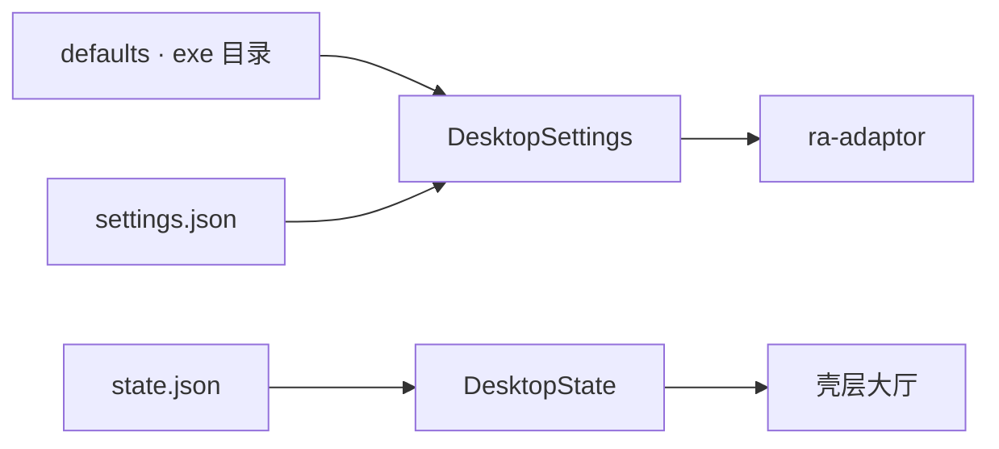

# ra-config

`ra-config` 负责 **settings / state 的取得、合并与诊断**。它回答「键值从哪来、谁覆盖了谁、哪一行解析失败」，**不**解释这些键在游戏或
Mod 里意味着什么——语义解析属于 `ra-adaptor` 与各 edition profile crate。

用户数据目录名统一为 **`rust-alert2`**：

| 平台 | 位置 |
|------|------|
| Windows | `%LOCALAPPDATA%/rust-alert2/` |
| macOS | `~/Library/Application Support/rust-alert2/` |
| Linux 等 | `$XDG_DATA_HOME/rust-alert2/` 或 `~/.local/share/rust-alert2/` |
| Web | `localStorage`：`rust-alert2.settings` / `rust-alert2.state` |

- **`settings.json`**（config）：分辨率、音量、质感呈现、`ra2_dir` 等
- **`state.json`**（state）：遭遇战大厅上次选择等可变记忆

可用 `RUST_ALERT2_DATA_DIR` 覆盖桌面用户数据根。默认 `ra2_dir` 为 exe 所在目录。

## 它是什么

- **`ConfigTable` / `ConfigLayer` / `MergedConfig`**：分层合并与诊断（测试 / 遗留迁移）；
- **`DesktopSettings`**：启动配置，读写 `settings.json`；
- **`DesktopState` / `SkirmishLobbyPrefs`**：用户状态，读写 `state.json`；
- **`PersistStore`**：桌面写文件，wasm 写 `localStorage`；
- **`exe_dir` / `user_data_dir`**：定位 exe 与用户数据根。



**Non-goals**：不恢复 exe 旁规范配置文件；不把遭遇战记忆写入 settings；不解析 INI / MIX；不连接 socket。

## 如何使用

```rust
use ra_config::{DesktopSettings, DesktopState};

let (settings, diagnostics) = DesktopSettings::load_or_default();
let (state, state_diags) = DesktopState::load_or_default();
for d in diagnostics.iter().chain(state_diags.iter()) {
    eprintln!("[{}] {}", d.source, d.message);
}
```

写回选项或遭遇战记忆：

```rust
DesktopSettings::persist_display_mode(mode)?;
DesktopState::persist_skirmish(&prefs)?;
```

### 键名约定（settings.json）

| 键 | 别名 | 含义 |
|----|------|------|
| `ra2_dir` | `game_dir`（遗留扁平表） | 安装根目录；省略则为可执行文件所在目录 |
| `edition` | — | 显式 `GameEdition` 字符串 |
| `display_mode` | `resolution` | 客户区分辨率档 |
| `music_volume` / `sound_volume` | — | 壳层音量 0..1 |
| `present` | — | 质感呈现对象 |
| `net_url` / `net_room` | — | 预留战网字段 |

若本机仍有遗留 exe 旁 `RustAlert.toml` 且 JSON 尚不存在，启动时只读迁移一次。

## 构建与测试

```shell
cargo test -p ra-config
```

## 许可证

本 crate 采用 **Apache-2.0**。
