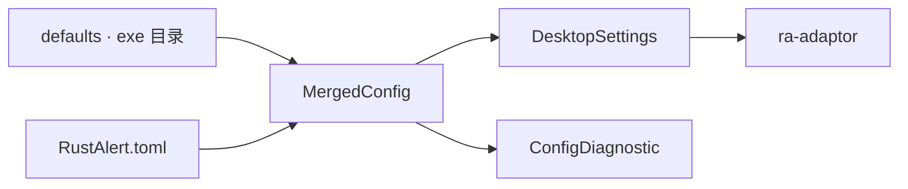

# ra-config

`ra-config` 负责 **配置的取得、分层合并与诊断报告**。它回答「键值从哪来、谁覆盖了谁、哪一行解析失败」， **不**解释这些键在游戏或
Mod 里意味着什么——语义解析属于 `ra-adaptor` 与各 edition profile crate。

桌面规范文件为可执行文件同目录的 **`RustAlert.toml`**，用 **`toml_edit`** 解析与回写（保留注释与格式）。分辨率等启动选项写在此文件中。
缺失时 `DesktopSettings::load_or_default` 会自动生成默认文件以便持久化。默认 `ra2_dir` 为 exe 所在目录。

## 它是什么

- **`ConfigTable` / `ConfigLayer` / `MergedConfig`**：分层合并与诊断；
- **`DesktopSettings`**：安装目录、版本字符串、预留联机字段；
- **`RustAlertDocument`**：打开 / 改键 / 保存 `RustAlert.toml`；
- **`parse_toml_document`**：把 TOML 根级键值展成扁平字符串表；
- **`exe_dir` / `rust_alert_toml_path`**：定位 exe 与规范配置路径。



**Non-goals**：不兼容旧名 `config.toml` / `ra2.toml`；不解析 INI / MIX；不连接 socket。

## 如何使用

```rust
use ra_config::DesktopSettings;

let (settings, diagnostics) = DesktopSettings::load_or_default();
for d in &diagnostics {
    eprintln!("[{}] {}", d.source, d.message);
}
```

编辑并保存：

```rust
use ra_config::RustAlertDocument;

let mut doc = RustAlertDocument::open_or_empty()?;
doc.set_str("edition", "yr");
doc.save()?;
```

### 键名约定（桌面）

| 键         | 别名            | 含义                                   |
|------------|-----------------|----------------------------------------|
| `ra2_dir`  | `game_dir`      | 安装根目录；省略则为可执行文件所在目录 |
| `edition`  | —               | 显式 `GameEdition` 字符串              |
| `net_url`  | `battlenet_url` | 预留战网地址                           |
| `net_room` | `room`          | 预留房间名                             |

结构化段：

| 表          | 类型          | 含义                                                                          |
|-------------|---------------|-------------------------------------------------------------------------------|
| `[present]` | `PresentFeel` | 壳层质感呈现（16 位色模拟）；`toml_edit` + serde 读写，不进扁平 `ConfigTable` |

模板见仓库根目录 `RustAlert.toml.example`。

## 构建与测试

```shell
cargo test -p ra-config
```

## 许可证

本 crate 采用 **Apache-2.0**。
