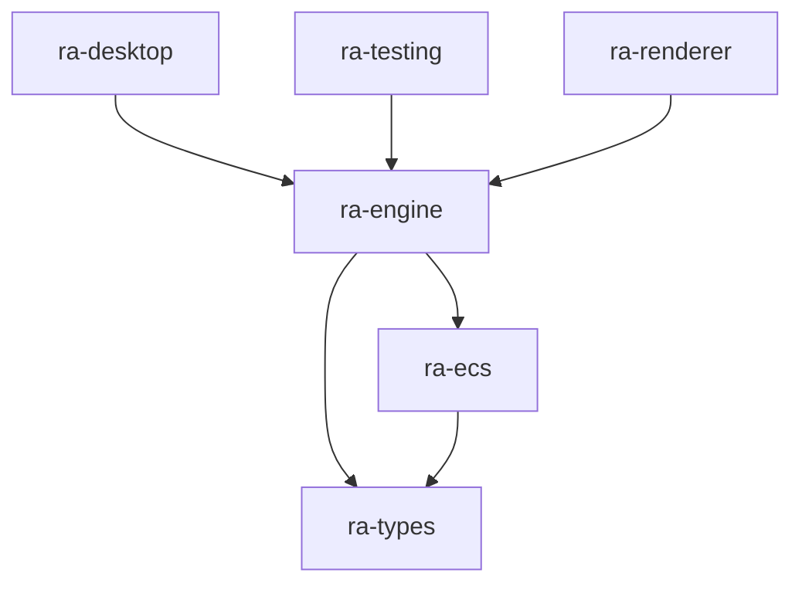
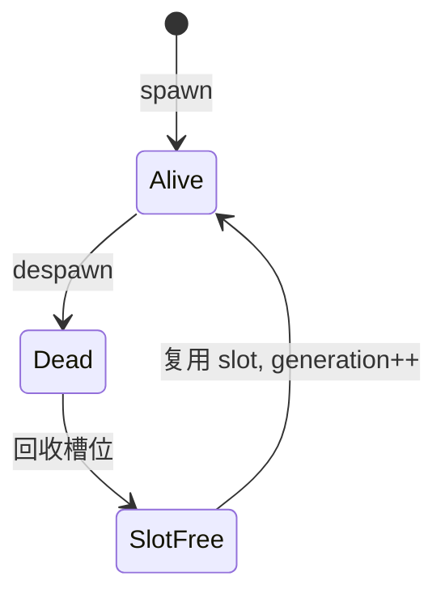
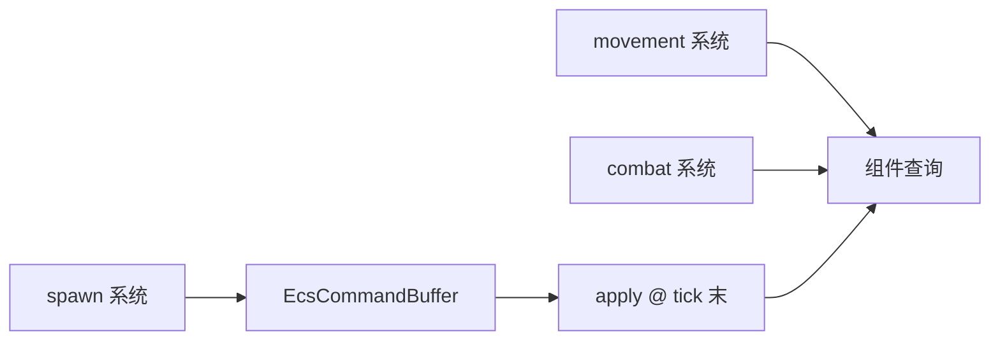

# ra-ecs

`ra-ecs` 提供 **通用实体—组件—系统**基础设施的骨架：实体槽位与世代、`EcsWorld` 容器、结构变更用的 `EcsCommandBuffer`。本
crate **刻意不含**坦克、矿场、占格、阵营等红警玩法语义——那些全部在 `ra-engine` 的 gameplay 与 state 模块中表达。

若你在寻找「如何选中单位」「MCV 如何部署」，请转向 `ra-engine`。若你在评估如何把引擎内部的实体存储从集中式结构体迁移到
ECS，或需要与 `ra-types::EntityId` 对齐的内部句柄，本包是起点。

## 它是什么

实体组件系统（ECS）把「谁存在」「携带什么数据」「每 tick 跑什么逻辑」解耦。大型 RTS 最终往往需要在 **大量同类实体**上批量执行系统，同时保证
**结构变更**（生成、销毁、添加/移除组件）在固定阶段提交，以维持确定性与可测性。

本 crate 当前是 **可编译骨架**，尚未接入 bevy_ecs、specs 等成熟实现。目的是先在依赖图上占位、固定对外类型名，并让 `ra-engine`
可以逐步把 `World` 内的实体表迁移到 ECS 存储，而不必一次性重写全部玩法。

关键区分：

| 概念                         | 所在 crate  | 用途                                   |
|------------------------------|-------------|----------------------------------------|
| `EcsEntity`                  | `ra-ecs`    | 引擎**内部**槽位 + 世代句柄            |
| `EntityId`                   | `ra-types`  | 命令、网络、UI、存档的**稳定对外身份** |
| 玩法组件（生命、占格、队列） | `ra-engine` | 仿真语义                               |

**映射关系由 `ra-engine` 独占维护**：外部 API 永远不应泄漏 `EcsEntity` 或组件存储下标。这与 `ra-engine` readme 中的硬边界一致。


## 在仓库中的位置



- **`ra-ecs` 仅被 `ra-engine` 依赖**（及测试）。桌面程序、渲染器、网络层不应直接 `use ra_ecs`。
- **无反向依赖**：本 crate 不依赖 `ra-engine`、`ra-adaptor` 或 `ra-assets`。
- **与 `RuntimeDefinitions` 正交**：定义契约描述规则表形状；ECS 描述运行时实体存储机制。

仿真 tick、命令校验、状态摘要仍在 `ra-engine`。本 crate 只回答「实体在内存里如何组织、结构变更何时生效」。

## 如何使用

### 引擎内部集成（当前骨架）

```rust
use ra_ecs::{EcsEntity, EcsWorld};

let mut world = EcsWorld::default();
let internal = EcsEntity { slot: 0, generation: 1 };

// 骨架阶段：contains 恒 false，apply 为空操作
assert!(!world.contains(internal));

let commands = world.commands();
world.apply(commands);
```

在真实用例落地前，引擎仍可使用集中式 `World` 结构。引入 ECS 时的推荐步骤：

1. 在新系统旁并行维护 `EntityId → EcsEntity` 映射表；
2. 只读系统先迁到组件查询；
3. 结构变更统一写入 `EcsCommandBuffer`，在 tick 末段 `apply`；
4. 对外命令路径继续只接受 `EntityId`。

### 依赖声明

```toml
[dependencies]
ra-ecs = { workspace = true }
```

除 `ra-engine` 外，一般 **不应**新增对本 crate 的依赖。若集成测试需要构造 ECS 世界，应通过 `ra-engine` 的公开会话 API。

### 你不应做的事

- 在本 crate 添加 `Health`、`OreTruck` 等玩法组件类型。
- 把 `EcsEntity` 序列化进网络协议或存档（除非引擎明确做内部调试工具，且不对玩家暴露）。
- 让 UI 层持有 `EcsWorld` 的可变引用跨越帧边界。

## 内部设计

### `EcsEntity`：槽位 + 世代

```rust
pub struct EcsEntity {
    pub slot: u32,
    pub generation: u32,
}
```

- **槽位**：组件数组中的索引；销毁后槽位可进入 freelist 复用。
- **世代**：每次槽位复用时递增；防止「旧句柄误命中新实体」的经典 ABA 问题。

对外 `EntityId` 可以是稳定 UUID、玩家可见编号或存档键； **与 `(slot, generation)` 的映射仅存于引擎**，并在实体销毁时失效旧
`EntityId` 或标记 generation 不匹配。



### `EcsWorld` 与 `EcsCommandBuffer`

当前 API：

| 方法       | 骨架行为   | 目标行为                         |
|------------|------------|----------------------------------|
| `contains` | 恒 `false` | 校验句柄仍有效                   |
| `commands` | 返回空缓冲 | 延迟 spawn/despawn/insert/remove |
| `apply`    | 空操作     | 在固定阶段批量提交变更           |

**为何需要命令缓冲**：若在系统迭代中途直接修改实体集合，会导致迭代器失效与非确定性顺序。RTS 引擎通常在「逻辑阶段末尾」或「专门
lifecycle 阶段」统一 `apply`，与 `ra-engine` 的 lifecycle 模块规划一致。

### 选型与演进

仓库尚未锁定第三方 ECS 库。候选方案将在 **真实迁移用例**（例如大量子弹、矿车、步兵混部）下评估：查询性能、确定性、wasm 体积、
`no_std` 需求等。无论底层实现如何，`EcsEntity` / 命令缓冲模式应保持稳定，以便上层代码少改动。



## 构建与测试

```shell
cargo check -p ra-ecs
cargo test -p ra-ecs
cargo doc -p ra-ecs --no-deps
```

骨架 crate 测试以 API 存在性与文档编译为主。ECS 行为的真实回归应放在 `ra-engine` 的 `entity_id`、会话与 headless
用例中——当映射表与组件存储落地后，增加「销毁后旧句柄拒绝」「同 tick 批量 spawn/despawn 确定性」等测试。

Workspace 级检查：

```shell
cargo check --workspace
```

修改 `EcsEntity` 布局或公开 API 时，请全量编译 `ra-engine`，确认无隐式依赖泄漏到 `ra-desktop`。

## 许可证

本 crate 采用 **Apache-2.0**，与 monorepo 内其它成员一致。
