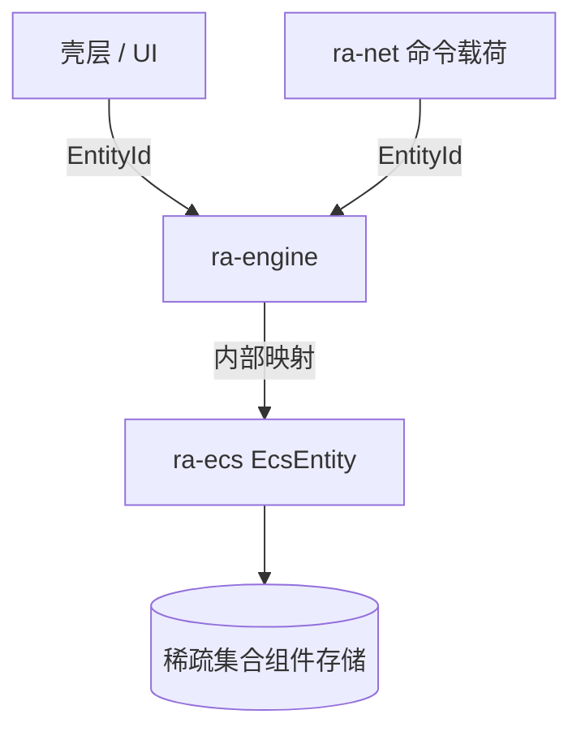
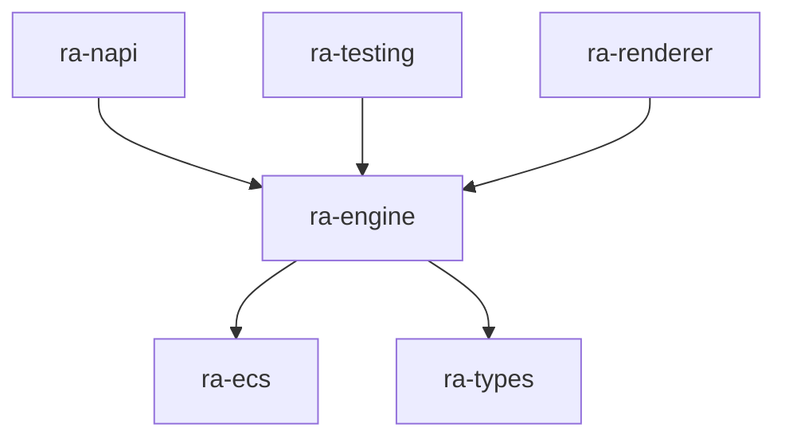

# ra-ecs

`ra-ecs` 提供 **通用实体—组件** 基础设施：槽位与世代句柄、稀疏集合组件存储、结构变更命令缓冲。本 crate **刻意不含**
坦克、矿场、占格、阵营等红警玩法语义——那些全部在 `ra-engine` 的 gameplay 与 state 模块中表达。

若你在寻找「如何选中单位」「MCV 如何部署」，请转向 `ra-engine`。若你在把引擎内部实体存储从集中式结构体迁移到 ECS，本包是存储层。

## 它是什么

实体组件系统（ECS）把「谁存在」「携带什么数据」「每 tick 跑什么逻辑」解耦。大型 RTS 需要在大量同类实体上批量执行系统，同时保证
**结构变更**（生成、销毁、添加/移除组件）在固定阶段提交，以维持确定性与可测性。

关键区分：

| 概念                         | 所在 crate  | 用途                                   |
|------------------------------|-------------|----------------------------------------|
| `EcsEntity`                  | `ra-ecs`    | 引擎**内部**槽位 + 世代句柄            |
| `EntityId`                   | `ra-types`  | 命令、网络、UI、存档的**稳定对外身份** |
| 玩法组件（生命、占格、队列） | `ra-engine` | 仿真语义                               |

**映射关系由 `ra-engine` 独占维护**：外部 API 永远不应泄漏 `EcsEntity` 或组件存储下标。



## 在仓库中的位置



- **`ra-ecs` 仅被 `ra-engine` 依赖**（及本 crate 测试）。桌面程序、渲染器、网络层不应直接 `use ra_ecs`。
- **无反向依赖**：本 crate 不依赖 `ra-engine`、`ra-adaptor`、`ra-assets` 或 `ra-types`。
- **与 `RuntimeDefinitions` 正交**：定义契约描述规则表形状；ECS 描述运行时实体存储机制。

仿真 tick、命令校验、状态摘要仍在 `ra-engine`。本 crate 只回答「实体在内存里如何组织、结构变更何时生效」。

## 如何使用

```rust
use ra_ecs::EcsWorld;

#[derive(Clone)]
struct Health(u32);

let mut world = EcsWorld::new();
let entity = world.spawn();
world.insert(entity, Health(100));
assert_eq!(world.get::<Health>(entity).map(|h| h.0), Some(100));

let mut commands = world.commands();
commands.despawn(entity);
world.apply(commands);
assert!(!world.contains(entity));
```

推荐在 `ra-engine` 中的用法：

1. 维护 `EntityId → EcsEntity` 映射表；
2. 系统通过组件查询读写状态；
3. 结构变更写入 `EcsCommandBuffer`，在 tick 阶段末 `apply`；
4. 对外命令路径继续只接受 `EntityId`。

### 依赖声明

```toml
[dependencies]
ra-ecs = { workspace = true }
```

除 `ra-engine` 外，一般 **不应**新增对本 crate 的依赖。

### 你不应做的事

- 在本 crate 添加 `Health`、`OreTruck` 等玩法组件类型。
- 把 `EcsEntity` 序列化进网络协议或存档。
- 让 UI 层持有 `EcsWorld` 的可变引用跨越帧边界。
- 依赖 `iter` 的稠密顺序做确定性逻辑（需要稳定序时按外部 `EntityId` 排序）。

## 内部设计

### `EcsEntity`：槽位 + 世代

- **槽位**：组件稀疏表中的索引；销毁后进入 freelist 复用。
- **世代**：销毁时递增；防止旧句柄误命中新实体。

### `EcsWorld` 与 `EcsCommandBuffer`

| 方法       | 行为                                       |
|------------|--------------------------------------------|
| `spawn`    | 立即分配存活实体                           |
| `despawn`  | 立即销毁并清除全部组件，旧句柄失效         |
| `insert` / `get` / `remove` | 按类型操作稀疏集合组件       |
| `commands` | 返回空缓冲，供阶段内入队结构变更           |
| `apply`    | 按入队顺序提交 spawn / despawn / insert / remove |


## 构建与测试

```shell
cargo check -p ra-ecs
cargo test -p ra-ecs
cargo doc -p ra-ecs --no-deps
```

## 许可证

本 crate 采用 **Apache-2.0**，与 monorepo 内其它成员一致。
