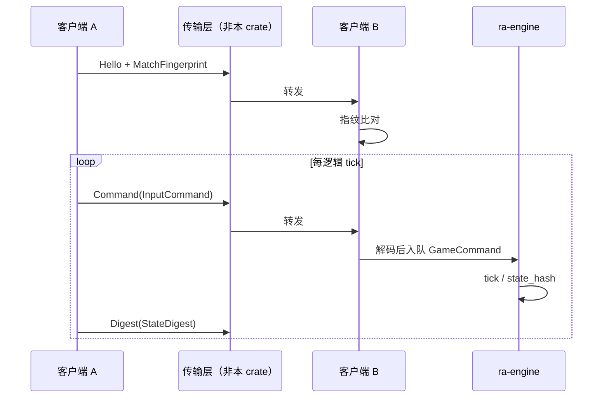
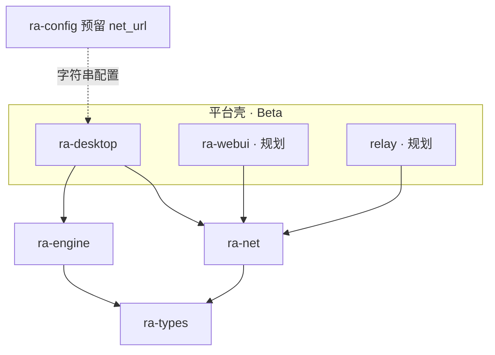
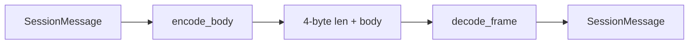

# ra-net

`ra-net` 提供联机对战的 **协议无关基础类型**：对局标识、内容指纹、带玩家与 tick 的输入命令、状态摘要、会话消息枚举，以及长度前缀成帧与严格序号窗。本
crate **不打开 socket**，不依赖 wgpu、窗口或具体传输（WebSocket、UDP、Steam 等）；平台壳负责字节流， **`ra-engine`
负责校验命令并推进权威仿真**。

联机能力标记为 **Beta**：类型与成帧已可用，房间、锁步调度、重连、观战与完整传输栈仍在演进。Alpha 单机路径不依赖本 crate。

## 它是什么

确定性 RTS 联机的核心是： **所有客户端在同一规则、同一地图、同一命令序列下产生相同状态**。网络层因此需要：

- 握手阶段对齐 **内容指纹**（版本、地图、规则哈希）；
- 传输阶段按 **tick** 绑定 **玩家输入**；
- 定期交换 **状态摘要** 以检测 desync；
- desync 时请求 **重同步快照**。

`ra-net` 把这些概念固化为 Rust 类型与纯函数编解码，使 `ra-desktop`、未来 Web 壳或专用 relay **共享同一消息形状**，而不把
TCP 细节塞进引擎。



**本 crate 不做的事**：socket 连接、NAT 穿透、房间匹配、输入延迟补偿、rollback 网码、加密。这些属于壳层或后续 crate。

## 在仓库中的位置



硬边界：

- **`ra-engine` 不依赖 `ra-net`**（依赖方向：壳层同时依赖两者）。引擎消费已解码的 `GameCommand` 或等价结构；payload 语义由引擎定义。
- **`ra-net` 不读盘、不挂载 MIX**。`MatchFingerprint::build` 接受调用方提供的规则字节。
- **渲染器不参与联机协议**。视觉不同步不应影响权威状态；摘要以 `ra-engine` 的 `state_hash` 为准。

仿真 tick、命令拒绝、胜负判定仍在 **`ra-engine`**。本 crate 只保证线上字节与类型一致。

## 如何使用

### 构建内容指纹

```rust
use ra_net::MatchFingerprint;

let rules_bytes = include_bytes!("../fixtures/rules.ini");
let fp = MatchFingerprint::build("yr", "map_name.map", rules_bytes);
let fp = fp.mix_bytes(b"players=2"); // 可选额外混入
```

握手时双方比较 `edition`、`map`、`rules_hash`。辅助函数 `fingerprint_matches_rules` 可快速校验哈希是否与本地规则文件一致。

### 编码会话消息

```rust
use ra_net::{
    encode_frame, decode_frame, SessionMessage, InputCommand, StateDigest,
    PROTOCOL_VERSION,
};
use ra_types::PlayerId;

let hello = SessionMessage::Hello {
    protocol: PROTOCOL_VERSION,
    fingerprint: fp,
};
let bytes = encode_frame(&hello)?;

let cmd = SessionMessage::Command(InputCommand {
    player: PlayerId(0),
    sequence: 0,
    tick: 1,
    payload: vec![/* 由引擎编解码 */],
});
let frame = encode_frame(&cmd)?;

let (msg, consumed) = decode_frame(&frame)?;
```

成帧格式：`[u32 BE 长度][body]`。单帧 body 上限 `MAX_PAYLOAD_BYTES`（64 KiB）。`Hello` 解码时若
`protocol != PROTOCOL_VERSION` 返回 `NetCodecError::ProtocolMismatch`。

### 严格序号窗

```rust
use ra_net::SequenceWindow;

let mut win = SequenceWindow::default();
assert!(win.accept(0));
assert!(!win.accept(2)); // 必须先 1
assert!(win.is_duplicate_or_old(0));
```

每个玩家命令流维护独立 `SequenceWindow`；乱序或重复包在壳层丢弃，不传入引擎。

### 常量

| 名称                | 值      | 含义             |
|---------------------|---------|------------------|
| `PROTOCOL_VERSION`  | `1`     | 不兼容变更时递增 |
| `MAX_PAYLOAD_BYTES` | `65536` | 单消息 body 上限 |

### 依赖声明

```toml
[dependencies]
ra-net = { workspace = true }
ra-types = { workspace = true }
```

## 内部设计

### 消息枚举 `SessionMessage`

| 变体             | 用途                          |
|------------------|-------------------------------|
| `Hello`          | 协议版本 + `MatchFingerprint` |
| `Command`        | `InputCommand`                |
| `Digest`         | `StateDigest`                 |
| `ResyncRequest`  | 请求从某 tick 对齐            |
| `ResyncSnapshot` | 附带序列化快照字节            |

body 首字节为标签（1–5）。字符串字段为 `u16 BE 长度 + UTF-8`。整数为大端。解码失败返回 `NetCodecError`（`Truncated`、
`PayloadTooLarge`、`UnknownTag`、`BadUtf8` 等）。



### `InputCommand` 字段

- `player: PlayerId` — 发送方；
- `sequence: u32` — 该玩家流内严格递增；
- `tick: u64` — 目标逻辑 tick（锁步调度由壳层保证）；
- `payload: Vec<u8>` — opaque 字节，通常由 `ra-engine` 命令编解码填充。

### `StateDigest`

```rust
pub struct StateDigest {
    pub tick: u64,
    pub hash: u64,
}
```

`hash` 应对齐 `ra-engine` 会话的 `state_hash()` 输出。频率与 desync 处理策略由联机壳层决定；本 crate 只运输。

### 哈希工具

`fnv1a64` / `MatchFingerprint::mix_bytes` 使用 FNV-1a 64 位。指纹算法变更需同步 bump `PROTOCOL_VERSION` 并更新全体客户端。

### 未来扩展

计划中的传输层将：

- 在 `ra-desktop` 或独立 binary 中建立连接；
- 把 `encode_frame` 输出写入 socket；
- 收到字节流后循环 `decode_frame`；
- 将 `Command` 转为 `GameCommand`  push 到 `Session`。

重同步快照格式由 `ra-engine` persistence 模块定义；`ResyncSnapshot.bytes` 仅为载体。

## 构建与测试

本 crate 无 IO、无 GPU，适合 CI 快速检查。

```shell
cargo check -p ra-net
cargo test -p ra-net
```

单元测试覆盖：round-trip 编解码、截断缓冲、过大 payload、协议版本不匹配、序号窗边界。集成测试在未来联机壳层与 headless
双实例对跑中补充。

```shell
cargo doc -p ra-net --no-deps
```

## 许可证

本 crate 采用 **Apache-2.0**。在网络服务中使用时请同时遵守游戏内容与第三方 Mod 的许可，本 crate 仅提供消息格式实现。
