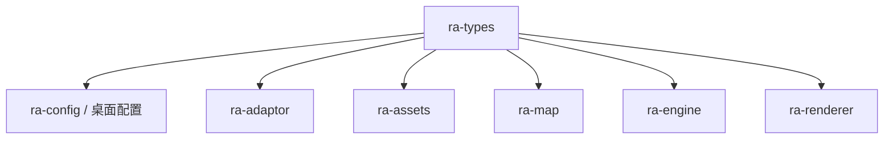
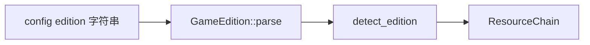
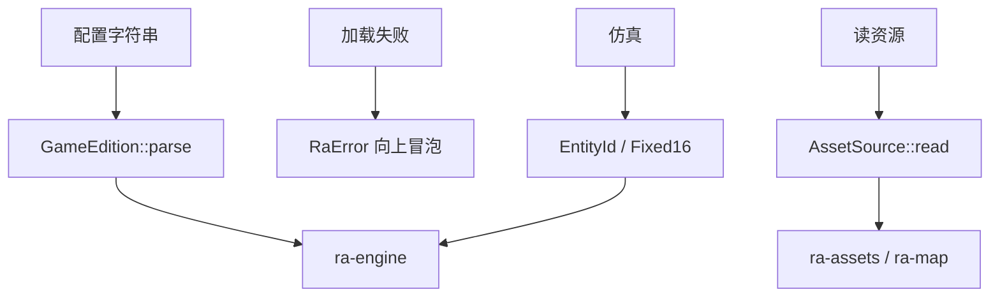

# ra-types

全体 `ra-*` crate 共享的 **基类型、命令载荷形状与冻结运行时定义契约**。本 crate 无解析器、无窗口、无 `std::fs`
——只有标识符、定点数、版本枚举、统一错误、`AssetSource` 与 `RuntimeDefinitions`。它是原生壳、Wasm 壳、 **`ra-engine`**、adaptor
与格式库之间的 **最小公共语言**。

一旦基类型开始读盘或创建窗口，桌面与浏览器目标就无法共用同一套边界；因此 MIX/SHP/地图/GPU 均** deliberately 不在此
crate**。定义归本 crate，适配归 `ra-adaptor`，执行归 `ra-engine`——不存在独立的 `ra-definition` / `ra-rules`。



## 模块结构

```
src/lib.rs                 重导出
src/id.rs                  EntityId / PlayerId / TypeId / WeaponId / …
src/time.rs                Tick / TickRate / DurationTicks
src/math.rs                Fixed（Fixed16 别名）/ Cell / Facing / …
src/command.rs             命令基础载荷形状
src/definition/            冻结 RuntimeDefinitions 契约
src/edition.rs             GameEdition
src/error.rs               RaError / RaResult
src/asset_source.rs        AssetSource
```

依赖：`thiserror`（`RaError` 派生）、`bitflags`（清单已声明，预留标志位类型）。

## `RuntimeDefinitions`

对局创建后不可变的内容定义集，是 adaptor / engine / renderer / desktop / testing / net 的共同语言。由 `ra-adaptor` 填充，
**不**单独拆 `ra-definition` crate。集合不含 ECS、实体、资金、tick、文件路径或 GPU 句柄。

```rust
use ra_types::RuntimeDefinitions;
let defs = RuntimeDefinitions::default();
assert_eq!(defs.content_fingerprint.hash, 0);
```

## `GameEdition`

```rust
pub enum GameEdition { Ra2, Yr, Mo3 }
```

表示「选用哪一套规则与资源布局」：

| 变体  | 典型布局特征                         |
|-------|--------------------------------------|
| `Ra2` | `game.exe` / `rules.ini` / `ra2.mix` |
| `Yr`  | `gamemd.exe` / `rulesmd.ini`         |
| `Mo3` | 心灵终结 3 / Phobos 扩展布局         |

| 方法     | 行为                                      |
|----------|-------------------------------------------|
| `as_str` | `Ra2`→`"ra2"`，`Yr`→`"yr"`，`Mo3`→`"mo3"` |
| `parse`  | 见别名表                                  |

`parse` 接受的别名（trim + ASCII 小写）：

| 输入                             | 结果                       |
|----------------------------------|----------------------------|
| `ra2` / `vanilla` / `original`   | `Ra2`                      |
| `yr` / `yuri` / `yuris` / `md`   | `Yr`                       |
| `mo3` / `mo` / `mentalomega` / … | `Mo3`                      |
| 其它                             | `Err(UnknownEdition(...))` |

配置里的 `edition` 字段最终走到这里；写错字符串会在启动早期失败，而不是默默当成原版。



## `RaError` / `RaResult`

```rust
pub type RaResult<T> = Result<T, RaError>;
```

| 变体                  | 典型触发                            |
|-----------------------|-------------------------------------|
| `UnknownEdition`      | `GameEdition::parse` 无效输入       |
| `AmbiguousEdition`    | 目录同时像原版又像 YR               |
| `CannotDetectEdition` | 启发式均未命中                      |
| `MissingFile`         | `AssetSource` 或壳层缺文件          |
| `Parse`               | MIX / INI / 地图等格式错误          |
| `Io`                  | 读写失败（壳层常从 `std::io` 映射） |
| `Msg`                 | 通用消息                            |

共享错误枚举的意义：桌面、adaptor、解析器可共用 `?`，不必在每一层 `map_err`。 **`ra-engine`** 拒绝命令时也可复用 `Parse` /
`Msg` 表达规则层原因（与网络 Beta 的协议错误分离在 `ra-net`）。

## 标识符：`EntityId` / `PlayerId` / `TypeId`

三个 newtype，分别包装 `u64` / `u8` / `u32`：

```rust
pub struct EntityId(pub u64);
pub struct PlayerId(pub u8);
pub struct TypeId(pub u32);
```

均派生 `Debug/Clone/Copy/Eq/Ord/Hash/Default`。字段公开，无额外方法——刻意保持薄包装，便于 ECS 与命令系统统一索引。

| 类型       | 用途                                              |
|------------|---------------------------------------------------|
| `EntityId` | 世界中单位、建筑、投射物等实例                    |
| `PlayerId` | 阵营与本地玩家（如 `local_player = PlayerId(0)`） |
| `TypeId`   | 规则表中的 techno / overlay 类型索引              |

**`ra-engine`** 的命令与快照 API 以这些 id 为稳定句柄；渲染器只读快照中的 id，不分配新 id。

## `Fixed16`

16.16 定点数，存于 `i32`：

| 项                                  | 含义       |
|-------------------------------------|------------|
| `ZERO`                              | `0`        |
| `ONE`                               | `1 << 16`  |
| `from_i32`                          | 整数转定点 |
| `to_i32_trunc`                      | 截断取整   |
| `saturating_add` / `saturating_sub` | 饱和运算   |

用于 **确定性**世界推进（坐标、速度、计时），避免不同平台 `f32` 非结合性。世界层逐步采用；基库先提供统一表示，避免半套浮点、半套整数。


## `AssetSource`

```rust
pub trait AssetSource {
    fn read(&self, relative: &str) -> RaResult<Vec<u8>>;
    fn exists(&self, relative: &str) -> bool {
        self.read(relative).is_ok()
    }
}
```

**平台 I/O 边界**：由壳实现；解析器只看见字节。

| 实现方                     | 行为                    |
|----------------------------|-------------------------|
| `ra-napi::GameAssetSource` | 松散文件优先 → `MixVfs` |
| 未来 `ra-webui`            | fetch / 打包资源 → 内存 |
| 测试夹具                   | `HashMap` 或内联字节    |

`ra-assets`、`ra-adaptor::load_rules_chain`、`ra-map` 均只接受 `&dyn AssetSource`，不直接 `std::fs::read`。

默认 `exists` 会整文件 `read` 一次——简单但对大文件不经济；具体实现可覆盖为 `stat` 优化。

## 刻意不在本 crate 的内容

| 能力                             | 归属                 |
|----------------------------------|----------------------|
| MIX / SHP / TMP / VXL / INI 解析 | `ra-assets`          |
| 安装目录探测                     | `ra-adaptor`         |
| `RulesSystem` 装载               | `ra-adaptor`         |
| 地图 IsoMapPack                  | `ra-map`             |
| GPU / 窗口                       | `ra-renderer` / 壳层 |
| 对局 tick / 命令                 | **`ra-engine`**      |

## 构建与 ABI 纪律

```shell
cargo build -p ra-types
```

无 feature、无 bin、无测试模块。改公共类型等于改全工作区 ABI 约定；提交前应 `cargo build` 编过所有下游 crate。

典型消费路径：



## 许可

Apache-2.0。本仓库不含原版游戏资源；运行需用户自行提供合法数据。
