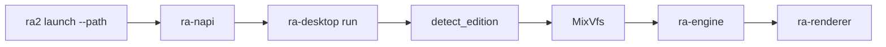

# ra-desktop

原生 GUI **宿主库**（`projects/hosts/ra-desktop`）。产品入口是 npm 包 **`@game-gpt/red-alert2`**（`ra2 launch --path`），经 N-API 调用本库的 `run`。本 crate **不再**产出独立二进制。

它连接玩家与 **`ra-engine`**：读配置、发现安装、挂载 MIX、装载规则与地图，再打开遭遇战会话，在 winit 事件循环里按固定 tick 推进仿真并用现代 GPU 绘制呈现快照。



## 配置

默认可读 `RustAlert.toml`。**CLI `--path` 覆盖**其中的 `ra2_dir`（可选 `--edition`）。

| 键 | 作用 |
|----|------|
| `ra2_dir` / `game_dir` | 游戏安装根目录 |
| `edition` | 可选 `ra2` / `yr` / `mo3` 等 |

模板见仓库根目录 `RustAlert.toml.example`。

## 开发启动

```shell
pnpm run build:native
pnpm exec ra2 launch --path "C:/Games/RA2"

cargo run -p ra-desktop --example launch
cargo run -p ra-desktop --example probe_boot -- "C:/path/to/your/ra2"
```

`test-harness` feature 仍可用于合成场景；配合环境变量 `RA2_TEST_SCENE` / `RA2_TEST_STATUS_PATH`。

## 构建

```shell
cargo build -p ra-desktop
cargo test -p ra-engine -p ra-map -p ra-assets
```
