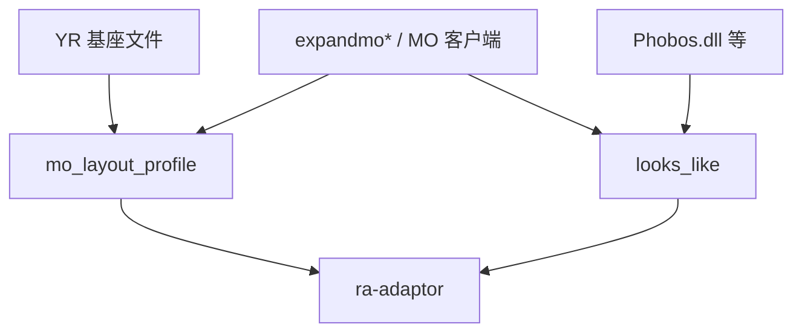
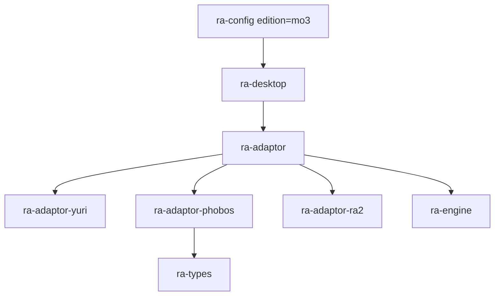
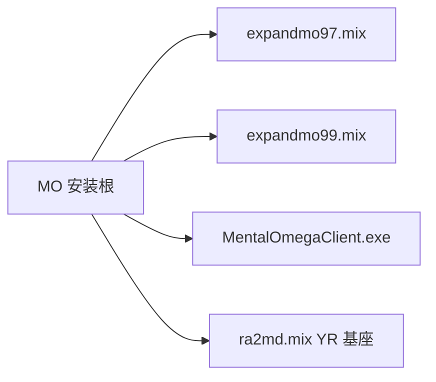

# ra-adaptor-phobos

`ra-adaptor-phobos` 承载 **Phobos 引擎扩展**及其常见内容布局的资源表与探测逻辑，其中**心灵终结 3（Mental Omega 3）**的安装布局归本
crate 管理，不再使用独立的 `ra-adaptor-mo3` 维度 crate。

本 crate 提供 `mo_layout_profile` / `profile`、`looks_like_phobos`、`looks_like_mo_layout` 与聚合的 `looks_like`，供
`ra-adaptor` 在 `GameEdition::Mo3` 路径下装配 `ResourceChain`。它 **不**注入 DLL、不执行 Phobos 脚本、不解析扩展 INI
语义——仅描述磁盘上应出现哪些文件名。

## 读者动线

1. 理解 Phobos / MO 在 edition 模型中的位置（「它是什么」）。
2. 看清与 YR 基座、`ra-adaptor` 编排的关系（「在仓库中的位置」）。
3. 引用 profile 与探测函数（「如何使用」）。
4. 资源表构成与启发式细节（「内部设计」）。
5. 构建测试与许可证。

## 它是什么

社区扩展（Phobos、心灵终结等）在 **尤里的复仇基座**上叠加大量 `expandmo*.mix`、`MentalOmegaClient.exe` 等特征文件。现代化重写需要与
RA2 / YR 一样，用 **静态 profile + 轻量探测**告诉 adaptor「该按哪套文件名 mount 与 load rules」。

配置层仍可写 `edition = "mo3"`：语义是 **YR 基座 + Phobos 系 MO 内容布局**的快捷方式， **不是**与 RA2 / YR
并列的第三套互斥「物理版本轴」。探测上，Phobos DLL 痕迹或 MO 客户端/layout 文件任一命中即可启用本 adaptor。



**Non-goals**：不模拟 Phobos 运行时；不保证与某一 MO 版本号 byte-level 一致；不替代用户合法拥有 YR + MO 内容的义务。

## 在仓库中的位置



`ResourceChain::for_edition(Mo3)` 内部调用 `from_phobos(ra_adaptor_phobos::profile())`。YR 的 `rulesmd.ini` / `artmd.ini`
文件名仍出现在 profile 中，因为 MO 内容通常覆盖 YR 规则表而保留相同 INI 名。

权威仿真、命令与 tick 仍在 **`ra-engine`**。本 crate 只影响 **内容发现与装载链**。

## 如何使用

### 获取 MO / Phobos 布局资源表

```rust
use ra_adaptor_phobos::{profile, mo_layout_profile};

let p = profile(); // 同 mo_layout_profile()
assert_eq!(p.exe_name, "MentalOmegaClient.exe");
assert_eq!(p.edition, ra_types::GameEdition::Mo3);
```

`root_mix_files` 包含 YR 与 MO 常见并列包，例如 `expandmo95.mix` … `expandmo99.mix`、`mapsmo03.mix`、`multimo.mix`、
`thememo.mix` 等。`nested_mix_files` 与 YR profile 对齐，供 `ra-adaptor` 统一嵌套 mount 逻辑使用。

### 探测函数

```rust
use ra_adaptor_phobos::{looks_like, looks_like_phobos, looks_like_mo_layout};
use std::path::Path;

let root = Path::new("D:/Games/MO");

if looks_like_phobos(root) {
    // Phobos.dll / Phobos.dll.inject / Phobos.CRT.dll
}

if looks_like_mo_layout(root) {
    // MentalOmegaClient.exe / RA2MO.ini / expandmo99.mix 等
}

if looks_like(root) {
    // 上述任一；适配器可倾向 Mo3 edition
}
```

| 函数                   | 检测目标                |
|------------------------|-------------------------|
| `looks_like_phobos`    | Phobos 相关 DLL         |
| `looks_like_mo_layout` | MO 客户端与 MO 扩展 MIX |
| `looks_like`           | 逻辑或，启用本 adaptor  |

与 YR 同时命中时，用户应通过 `config.toml` 显式指定 `edition`，避免 `ra-adaptor` 返回模糊错误。

### 配置快捷方式

`ra-config` 解析的 `edition = "mo3"` 映射到 `GameEdition::Mo3`，进而选择本 profile。字符串别名由 `ra-types` 与 adaptor
枚举转换维护；本 crate 不读取配置文件。

### 依赖声明

```toml
[dependencies]
ra-adaptor-phobos = { workspace = true }
ra-types = { workspace = true }
```

## 内部设计

### `ResourceProfile` 同形策略

与 `ra-adaptor-yuri` / `ra-adaptor-ra2` 相同，`ResourceProfile` 在本 crate 重复定义，避免 profile crate 之间的循环依赖。字段语义一致：
`edition`、`root_mix_files`、`nested_mix_files`、四类 INI 名、`exe_name`。

### MO 根 MIX 列表设计考量

列表兼顾：

- **YR 共存文件**（`ra2md.mix`、`langmd.mix` 等），便于从完整 MO 安装一键识别；
- **MO 特有 expand 包**（`expandmo94`–`expandmo99` 等），覆盖不同 MO 版本常见打包；
- **地图与主题包**（`mapsmo03.mix`、`thememo.mix`），供多人地图与 UI 资源 mount。

`ra-adaptor` 的 `scan_root_mixes` 仅检查文件是否存在，不验证 MIX 内容；真正 `mount_bytes` 在 `ra-desktop` 启动流程。



### 与 Phobos 扩展语义的分界

Phobos 引入大量新 INI 键与行为（例如自定义 super weapon、附加 armor 类型）。 **语义解析**将在 `ra-assets` + `ra-adaptor` +
`ra-engine` gameplay 中逐步实现；本 crate 的 `ResourceProfile` 只保证 **文件链**正确，使规则字节能被读入。未来若 MO 改用独立
`rulesmo.ini` 等，应在本 profile 调整 `rules_ini` 并 bump 探测逻辑，而非在引擎硬编码路径。

### 维护指南

MO 版本更新若重命名 MIX 或客户端 exe：

1. 更新 `root_mix_files` 与 `looks_like_mo_layout`；
2. 在 `ra-adaptor` 集成测试中增加临时目录 fixture；
3. 文档同步本 readme 表格；
4. 不将 MO 版本号写入 `ra-engine` 或开源 README 的里程碑代号。

## 构建与测试

```shell
cargo check -p ra-adaptor-phobos
cargo test -p ra-adaptor-phobos
```

推荐测试：`looks_like_*` 在空目录为 false、在 touch 特征文件后为 true；`profile()` 返回静态切片非空且 `edition == Mo3`。

```shell
cargo check --workspace
```

## 许可证

本 crate 采用 **MPL-2.0**。Phobos 与 Mental Omega 为各自作者之社区项目；本 crate 仅列出常见安装布局中的 **文件名**，不包含
MO 受版权保护的游戏内容。使用 adaptor 装载前请确保你拥有合法基座游戏与 Mod 分发许可。
