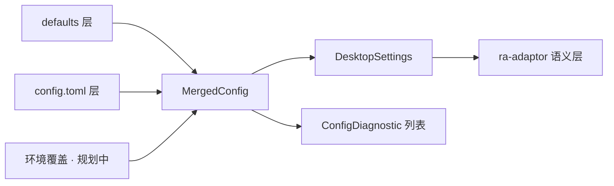
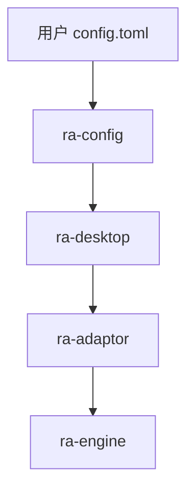
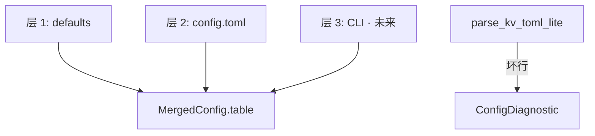

# ra-config

`ra-config` 负责 **配置的取得、分层合并与诊断报告**。它回答「键值从哪来、谁覆盖了谁、哪一行解析失败」， **不**解释这些键在游戏或
Mod 里意味着什么——语义解析属于 `ra-adaptor` 与各 edition profile crate。

若你需要在桌面启动时读取 `config.toml`、合并默认值与用户覆盖、并把 `ra2_dir` / `edition` 交给 adaptor，本 crate
提供机械层支持。若你要解析 `rules.ini` 里的 `[VehicleTypes]`，请使用 `ra-assets` 与 adaptor。

## 读者动线

1. 理解配置机械层与游戏语义的边界（「它是什么」）。
2. 看清在启动链中的位置（「在仓库中的位置」）。
3. 加载桌面设置或自定义合并流程（「如何使用」）。
4. 了解 `ConfigTable`、合并规则与 TOML 子集解析（「内部设计」）。
5. 构建测试与许可证。

## 它是什么

现代游戏启动往往有多层配置来源：内置默认值、用户主目录下的文件、命令行覆盖、（未来）环境变量。合并规则必须
**显式、可诊断、可测试**，而不能在多个 crate 里各自 `read_to_string` 然后静默覆盖。

本 crate 提供：

- **`ConfigTable`**：扁平字符串键值表（`BTreeMap` 保证迭代顺序稳定）；
- **`ConfigLayer`**：带来源标签的一层配置；
- **`MergedConfig`**：按顺序合并多层，并收集 `ConfigDiagnostic`；
- **`DesktopSettings`**：从合并结果提取桌面关心的字段（安装目录、版本字符串、预留联机 URL/房间名）；
- **`parse_kv_toml_lite`**：解析极简 `key = "value"` 文本（支持 `#` 行注释， **不支持** TOML 表与数组）；
- **`read_first_existing`**：在候选路径列表中取第一份存在的文件。



**Non-goals**：不定义 Mod 目录规范；不要求用户迁移到特定文件夹布局；不解析 INI 段或 MIX 索引；不连接 socket（`net_url`
仅作字符串存储，供未来 Beta 联机壳层读取）。

## 在仓库中的位置



- **`ra-desktop`** 在启动早期调用 `DesktopSettings::load_or_default()`，把路径与可选 `edition` 传给 adaptor。
- **`ra-adaptor`** 根据 `edition` 与安装目录做 **语义**探测（`looks_like`、`ResourceChain`），本 crate 不参与。
- **`ra-engine`** 不直接依赖 `ra-config`；对局内规则来自已装载的 `RulesDb` / 未来的 `RuntimeDefinitions`。

仿真重心仍在 `ra-engine`：命令、tick、状态摘要。本 crate 仅服务 **壳层启动前**的配置机械层。

## 如何使用

### 一键加载桌面设置

```rust
use ra_config::DesktopSettings;

let (settings, diagnostics) = DesktopSettings::load_or_default();

for d in &diagnostics {
    eprintln!("[{}] {}", d.source, d.message);
}

// settings.ra2_dir — 游戏安装目录
// settings.edition — 可选显式版本，如 "yr" / "mo3"
// settings.net_url / settings.net_room — 预留，当前无 socket
```

默认搜索 `config.toml` 与 `ra2.toml`（当前工作目录）。默认值层把 `ra2_dir` 设为 `"."`。

### 自定义多层合并

```rust
use ra_config::{ConfigLayer, ConfigTable, MergedConfig};

let defaults = ConfigLayer {
    label: "defaults".into(),
    table: {
        let mut t = ConfigTable::new();
        t.insert("ra2_dir", "C:/Games/RA2");
        t
    },
};

let user = ConfigLayer {
    label: "user.toml".into(),
    table: {
        let mut t = ConfigTable::new();
        t.insert("edition", "yr");
        t
    },
};

let merged = MergedConfig::merge_layers(&[defaults, user]);
assert_eq!(merged.get("edition"), Some("yr"));
```

后层覆盖前层同名键。若需记录「未知键」或「类型错误」，在合并后由 adaptor 或壳层追加 `ConfigDiagnostic`，本 crate 不强制 schema。

### 解析轻量 TOML 文本

```rust
use ra_config::parse_kv_toml_lite;

let text = r#"
ra2_dir = "D:/YR"
edition = "yr"  # 显式尤里
"#;
let (table, diags) = parse_kv_toml_lite(text, "inline");
```

以 `[` 开头的行（真实 TOML 表头）会被 **跳过**而非报错——这是刻意限制，避免在本 crate 引入完整 TOML 依赖。复杂配置请将来改用专用解析器或壳层
JSON。

### 键名约定（桌面）

| 键         | 别名            | 含义                      |
|------------|-----------------|---------------------------|
| `ra2_dir`  | `game_dir`      | 安装根目录                |
| `edition`  | —               | 显式 `GameEdition` 字符串 |
| `net_url`  | `battlenet_url` | 预留战网地址              |
| `net_room` | `room`          | 预留房间名                |

adaptor 读取 `edition` 后选择 `ra-adaptor-ra2` / `ra-adaptor-yuri` / `ra-adaptor-phobos` profile； **含义不在本 crate**。

### 依赖声明

```toml
[dependencies]
ra-config = { workspace = true }
```

## 内部设计

### 合并语义

`MergedConfig::merge_layers` 顺序遍历层，对每个键执行 `insert` 覆盖。诊断向量默认空；文件解析阶段的错误附加在
`MergedConfig::diagnostics` 或 `load_or_default` 的返回值中。



### 诊断结构

```rust
pub struct ConfigDiagnostic {
    pub source: String,  // 如 "config.toml:12"
    pub message: String,
}
```

壳层应把诊断输出到日志或启动 UI，而不是静默丢弃。缺文件 **不是**错误——`read_first_existing` 返回 `None` 时仅使用默认层。

### 与联机 Beta 的关系

`DesktopSettings` 预留 `net_url` / `net_room` 字段，供未来 `ra-net` 壳层读取。本 crate **不**实现握手、成帧或序号窗；协议类型见
`ra-net` readme。

### 线程与平台

当前 API 为同步、基于 `std::fs`。桌面启动路径足够；若将来需要热重载，可在壳层文件监视器中重新调用合并逻辑，并把新
`DesktopSettings` 交给「需重启生效」的策略，而不是在 tick 内读盘。

## 构建与测试

```shell
cargo check -p ra-config
cargo test -p ra-config
```

测试覆盖：空合并、层覆盖、`parse_kv_toml_lite` 注释与坏行、`DesktopSettings::from_merged` 字段映射。集成场景在 `ra-desktop`
启动测试中验证「缺文件回退默认」「显式 edition 透传」。

Workspace：

```shell
cargo check --workspace
```

## 许可证

本 crate 采用 **MPL-2.0**。修改源文件时请遵守 MPL-2.0 的再许可与标注要求。
