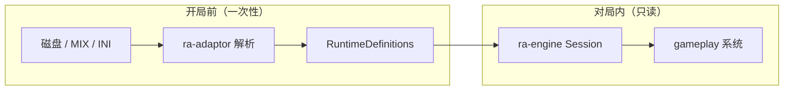
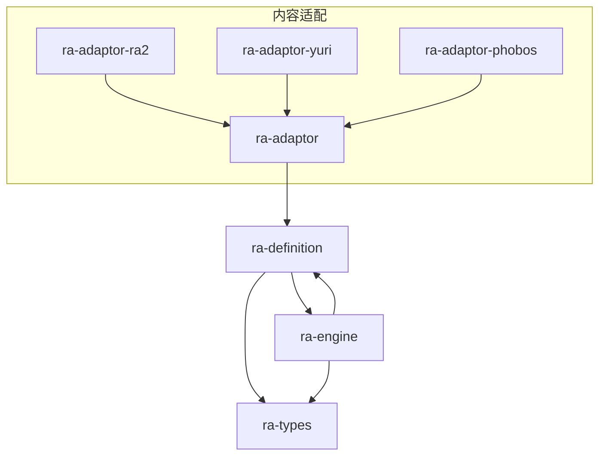
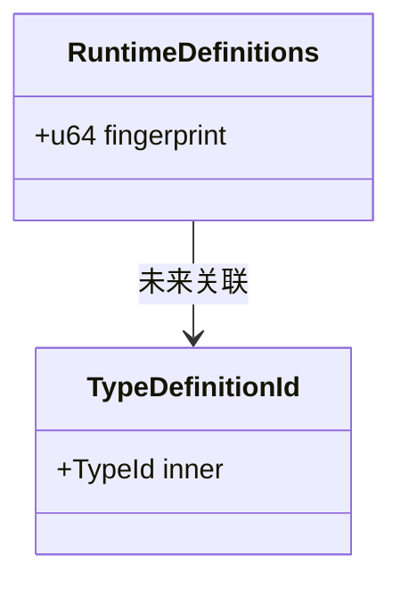

# ra-definition

`ra-definition` 提供 **冻结运行时定义**的公共契约：adaptor 在开局前把规则、类型与内容指纹整理成一份只读结构，对局启动后
`ra-engine` 只消费这份结构，不再回头读取磁盘上的 INI 或 MIX。本 crate 是 adaptor 与引擎之间的 **单向边界**，双方只依赖这里的类型与
`ra-types`，从而避免循环依赖。

若你正在实现新的内容适配层，或想把引擎里的「规则长什么样」从实现细节里抽出来，本包就是应当首先对齐的接口面。

## 读者动线

1. 理解「冻结定义」在一局对局中的生命周期（下文「它是什么」）。
2. 看清本 crate 在仓库依赖图中的位置（「在仓库中的位置」）。
3. 作为 adaptor 或引擎开发者接入 `RuntimeDefinitions`（「如何使用」）。
4. 了解当前骨架与未来扩展方向（「内部设计」）。
5. 运行测试与确认许可证（「构建与测试」「许可证」）。

## 它是什么

红警类 RTS 的规则数据体量巨大：单位表、武器表、建筑表、阵营差异、扩展 Mod 覆盖层等。引擎在 tick 循环里需要的是
**已经解析、已经归一化、已经按对局冻结**的一份定义，而不是在每一帧重新打开 `rules.ini`。

`RuntimeDefinitions` 就是这份冻结集合的容器。对局创建时 adaptor 填充它；`Session` / `World`
打开后只读引用；对局结束随会话销毁。任何「热重载规则」都不在本 crate 的职责范围内——那属于壳层重新开局。

当前实现仍是 **骨架**：`RuntimeDefinitions` 仅含 `fingerprint` 字段，`TypeDefinitionId` 作为类型定义的占位标识。随着玩法系统（生产、战斗、部署等）在
`ra-engine` 中落地，相应字段会按模块逐步补齐，但 **契约 crate 保持稳定、增量扩展**，避免引擎与 adaptor 互相 `#use` 对方的私有模块。



## 在仓库中的位置

仿真重心在 `ra-engine`：权威状态、命令队列、固定逻辑 tick、状态摘要均由引擎持有。`ra-definition` 不执行任何玩法逻辑，也不接触渲染或网络
socket。它位于 adaptor 与引擎之间的 **数据契约层**。



硬边界：

- **adaptor 不得**依赖 `ra-engine`。填充 `RuntimeDefinitions` 是 adaptor 的上游职责。
- **引擎不得**在 tick 内直接读取用户安装目录。所需定义必须已在开局前注入。
- **消费方（桌面、测试、渲染）** 不应绕过本契约直接修改规则表；命令与快照 API 才是对外面。

与当前过渡期的关系：仓库里仍存在 `RulesDb` 等由 `ra-adaptor` 直接交给 `open_skirmish_session` 的路径。长期方向是把这些投影统一收敛到
`RuntimeDefinitions`，使「引擎需要什么形状」在本 crate 里一次声明完毕。

## 如何使用

### 作为 adaptor 开发者

在识别版本、装载 INI、构建类型注册表之后，构造 `RuntimeDefinitions` 并交给引擎入口（或中间引导层）。指纹应覆盖足以区分两局是否「同规则同地图」的材料，便于日后与
`ra-net` 的 `MatchFingerprint` 对齐。

```rust
use ra_definition::{RuntimeDefinitions, TypeDefinitionId};
use ra_types::TypeId;

let mut defs = RuntimeDefinitions::default();
defs.fingerprint = 0xDEAD_BEEF_CAFE; // 示例：由规则字节与地图元数据混入

let tank_id = TypeDefinitionId(TypeId::from_name("MTNK"));
// 后续：defs.units.insert(tank_id, ...);
```

adaptor 侧只应 `use ra_definition` 与 `ra_types`，不要引用 `ra-engine` 的内部模块。

### 作为引擎开发者

在 `Session` 打开或 `World` 初始化阶段接收 `RuntimeDefinitions`（或从其派生的只读视图），存入对局上下文。gameplay 系统通过
`TypeDefinitionId` 查表，而不是硬编码 INI 段名。

引擎测试可以使用最小 synthetic 定义，无需挂载真实 MIX——这与 `ra-testing` 内置夹具的做法一致。

### 依赖声明

在 workspace 成员的 `Cargo.toml` 中：

```toml
[dependencies]
ra-definition = { workspace = true }
ra-types = { workspace = true }
```

本 crate 无额外特性开关；保持默认 feature 集即可。

## 内部设计

### 核心类型

| 类型                 | 职责                                                   |
|----------------------|--------------------------------------------------------|
| `RuntimeDefinitions` | 对局级冻结定义集；含内容 `fingerprint`                 |
| `TypeDefinitionId`   | 单位/建筑等规则类型的稳定标识，包装 `ra-types::TypeId` |

`fingerprint` 当前为 `u64` 占位。实际混入策略（规则字节 FNV、地图尺寸、玩家数等）由 adaptor 与 `ra-net` 握手机制协同定义；本
crate 只保留字段，不规定哈希算法细节。

### 扩展原则

新增定义域（例如武器 verses、建造队列模板、阵营特有 super weapon）时：

1. 在 `RuntimeDefinitions` 上增加字段或子结构；
2. 保持 `Clone` 以便会话快照与调试复制；
3. 不在本 crate 引入 `ra-assets`、`ra-map` 等解析依赖——解析留在 adaptor；
4. 文档与单元测试同步更新，确保「空定义 + 默认值」仍可编译。



### 确定性与版本

冻结定义在 **逻辑 tick 0 之前**必须完整。对局中途若内容变更，应结束当前局并以新定义重新 `open`。这与 `ra-engine` 的状态摘要（
`state_hash`）假设一致：同一命令序列在同一冻结定义下应产生相同摘要。

## 构建与测试

本 crate 体量小，编译快速，适合作为依赖链上的早期检查点。

```shell
cargo check -p ra-definition
cargo test -p ra-definition
cargo doc -p ra-definition --no-deps
```

当前单元测试以类型可构造性、文档示例编译为主。随着字段增多，应增加「最小定义 + serde 往返（若引入）+ 指纹稳定性」等测试。集成测试放在
`ra-engine` 或 `ra-testing`，不在本 crate 重复造会话。

在完整 workspace 中验证：

```shell
cargo check --workspace
```

若你只修改了 `RuntimeDefinitions` 的字段布局，请同步更新 adaptor 填充逻辑与引擎读取点，并跑 `ra-engine` 的相关集成测试，避免静默字段漂移。

## 许可证

本 crate 采用 **MPL-2.0**（Mozilla Public License 2.0），与 workspace 内其它 `ra-*` 成员一致。分发或嵌入时请保留许可证与版权声明；修改后的源文件需按
MPL-2.0 要求标注变更。
