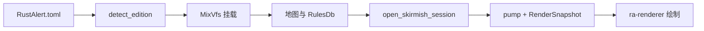
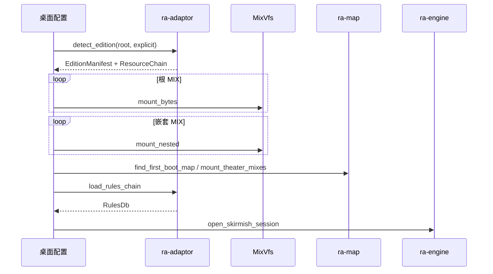
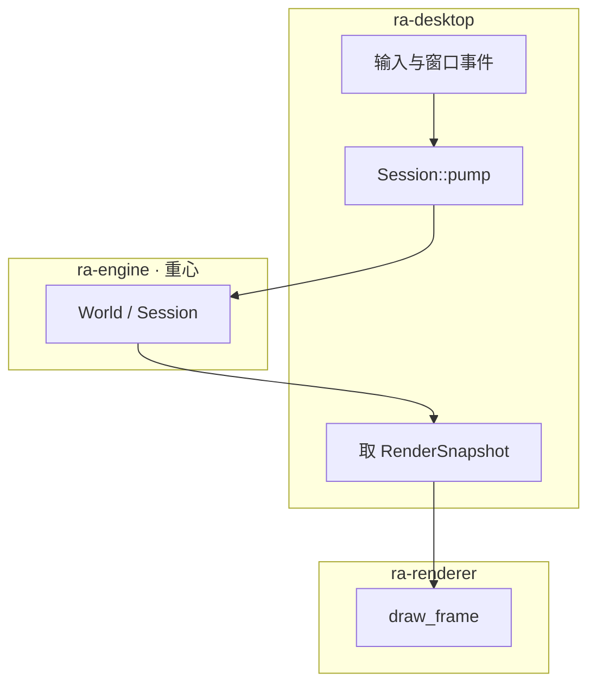
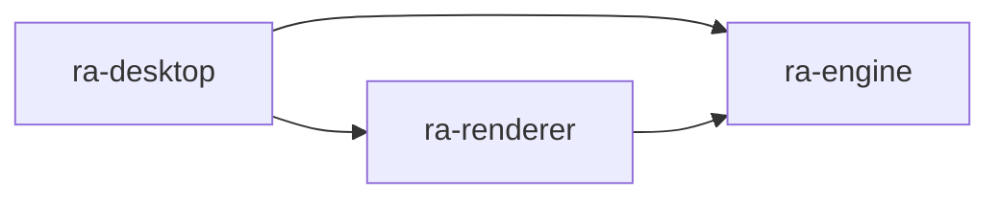

# ra-desktop

工作区默认成员。本 crate 产出原生 GUI 二进制 **`ra2`**（Windows 上为 **`ra2.exe`**）。它是玩家与 **`ra-engine`**
对局运行时之间的桥梁：读配置、发现安装、挂载 MIX、装载规则与地图，再打开遭遇战会话，最后在 winit 事件循环里按固定 tick
推进仿真并用现代 GPU 绘制呈现快照。

本包 **不是**命令行工具，也 **不是** DirectDraw 兼容层或向原版 `game.exe` 注入的壳。窗口与 wgpu 呈现由 `ra-renderer`
负责；权威对局状态与逻辑时间只在 `ra-engine` 内推进。



## 配置

进程读取 **可执行文件同目录**的 `RustAlert.toml`（由 `toml_edit` 解析）。缺文件时默认 `ra2_dir` 为 exe 所在目录、`edition = None`，因此把 `ra2.exe` 直接放进游戏安装目录即可启动。

| 键                     | 作用                                                                        |
|------------------------|-----------------------------------------------------------------------------|
| `ra2_dir` / `game_dir` | 含零售 MIX、INI 的游戏安装根目录；省略则为 exe 同目录                       |
| `edition`              | 可选：`ra2`、`yr`、`mo3` 及 `GameEdition::parse` 接受的别名；省略则自动探测 |

示例：

```toml
ra2_dir = "C:/Games/RA2"
edition = "ra2"
```

模板见仓库根目录 `RustAlert.toml.example`。若目录同时具备原版与尤里的复仇特征，自动探测会报歧义，此时必须显式写明 `edition`。仓库不包含原版资源，运行前请自行准备合法取得的游戏数据。

启动命令：

```shell
cargo run -p ra-desktop
# 工作区根等价于
cargo run
```

Release 构建在 Windows 上使用 `windows_subsystem = "windows"`（无控制台）；Debug 仍可通过标准错误输出看到启动诊断。

## 安装发现与 MIX 挂载

启动流水线（`boot_world`）按固定顺序执行，与 `main.rs` 一致：



1. **`detect_edition`**：由 `ra-adaptor` 识别 `GameEdition`，扫描 `ResourceChain` 中的根 MIX 是否在磁盘存在，得到
   `EditionManifest`（含 `present_mixes` / `missing_mixes`）。
2. **根包挂载**：对每个 `present_mixes` 条目，`find_ci_file` → 读字节 → `MixVfs::mount_bytes`。
3. **嵌套包挂载**：对 `chain.nested_mix_files` 逐个 `mount_nested`；缺失或损坏时静默跳过，不阻断开窗。
4. **剧院 MIX**：启动地图解析成功后，按 `ra-map` 的 `theater_mix_names` 再挂载对应地形包。

`GameAssetSource` 实现 `AssetSource::read`：安装根上大小写不敏感查找松散文件优先，否则查 `MixVfs`。开发时可将单个 `.shp` /
`.ini` 放在游戏目录旁覆盖包内同名条目，无需改 MIX。

## 内容引导：地图、预览与规则

地图候选由 `ra-map::BOOT_MAP_CANDIDATES` 决定（如 `mp01t4.map` 等）。首个能在 VFS 中解析成功的地图定剧院并触发剧院 MIX 挂载。

预览合成：

1. **`compose_boot_preview`**：地图含有效地形单元格时拼整幅 RGBA；失败返回 `None`，**不**用单砖或单位 SHP 冒充。
2. 显式探测可用 **`load_fallback_theater_tile`** / **`load_fallback_unit_sprite`**（须调用方主动选用，不进入 boot 成功路径）。

规则由 `load_rules_chain` 读取 `rules.ini` / `art.ini` 并派生 `RulesDb`。成功则进入 `open_skirmish_session`；失败时仍可开窗，窗口标题与
`boot_note` 会标明规则未就绪。

窗口标题格式：`ra2 ({edition}) · {boot_note} · t{tick}`。`boot_note` 汇总 MIX 挂载计数、地图名与尺寸、预览来源、规则节数或错误摘要。标准错误还会输出
`ra2 boot: …` 与 `ra2 gpu: {backend} · preview=yes|no`。

## 对局会话与主循环

对局权威在 **`ra-engine`**。桌面壳只做 I/O、输入翻译与呈现调度：



`App` 实现 winit `ApplicationHandler`：

- **`resumed`**：创建约 1024×768 窗口，`renderer.attach_window` 绑定 wgpu 表面（DX12 / Vulkan / Metal， **非 DirectDraw**）。
- **`RedrawRequested`**：根据经过时间调用 `Session::pump` 推进固定逻辑 tick → 生成 `RenderSnapshot` → `draw_frame` →
  刷新标题 → 再次 `request_redraw`。
- **`about_to_wait`**：持续请求重绘；`ControlFlow::Poll`。

逻辑帧率与显示器刷新率解耦：仿真 tick 由引擎时钟控制，GPU 只消费快照。选中、拖拽平移、建造放置等输入在壳层转为 `GameCommand`
提交给会话。

## 源码布局

```
src/main.rs       入口
src/shell.rs      页面壳与事件循环
src/ui_page.rs    原版页面资源索引（未解码；visuals_ready 前不算交付）
src/ui_slots.rs   入口 id 与命中框槽位
src/ui_hit.rs     逻辑命中（无绘制）
src/menu_action.rs 菜单导航动作
src/config.rs     委托 ra-config 加载桌面设置
src/fs_source.rs  GameAssetSource
examples/
  probe_boot.rs     无窗口：挂载 + load_rules
  probe_tmp.rs      无窗口：剧院 TMP 统计
  probe_shp.rs      无窗口：SHP 首帧
  probe_theater.rs    无窗口：剧院 MIX / 地图体积
```

## 探针与测试构建

无窗口验证（需自备游戏目录）：

```shell
cargo run -p ra-desktop --example probe_boot -- "C:/path/to/your/ra2"
```

固定合成场景（可选 feature `test-harness`）：

```shell
cargo run -p ra-desktop --features test-harness -- --test-scene=duel
```

此时窗口固定 1280×720，对局来自 `ra-testing::standard_duel`，不读安装目录。设置 `RA2_TEST_STATUS_PATH` 可每帧写出 tick /
hash / outcome 供自动化轮询。

## 关键页截图（验收用，不进 git）

色块占位菜单已拆除。验收图须在原版 SHP/字体接线后，用 GPU 画面对照；稳定文件名见
`ra-testing::pre_alpha_acceptance_capture_names()`。

运行中按 **F12** 将当前 GPU 画面写入 `screenshots/{screen}_{unix_ms}.png`。

进入关键页时自动各截一次：

```shell
set RA2_AUTO_SCREENSHOT=1
cargo run -p ra-desktop
```

也可用 `RA2_SCREENSHOT_DIR` 改根目录。`screenshots/` 已在 `.gitignore` 中，请勿把 PNG 提交进仓库。

## 依赖关系

串联：`ra-types`、`ra-config`、`ra-adaptor`、`ra-assets`、`ra-map`、 **`ra-engine`**、`ra-renderer`。不直接依赖各 edition
profile crate（经 `ra-adaptor` 装配），也不依赖 `ra-webui`。



## 构建

工具链见仓库根 `rust-toolchain.toml`（nightly）。`publish = false`。

```shell
cargo build -p ra-desktop
cargo test -p ra-engine -p ra-map -p ra-assets
```

## 许可

MPL-2.0（与工作区一致）。二进制只是引擎壳；玩法与美术数据来自用户指定的目录。
