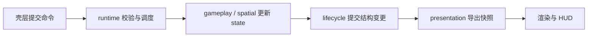
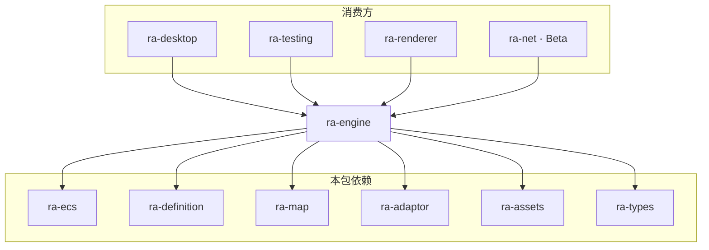
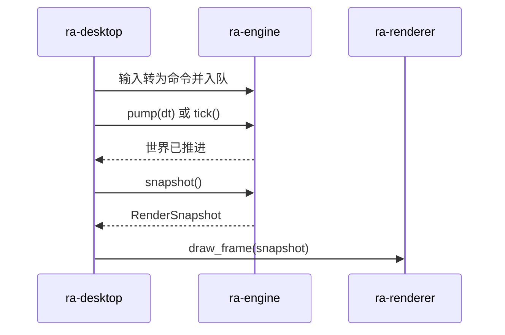
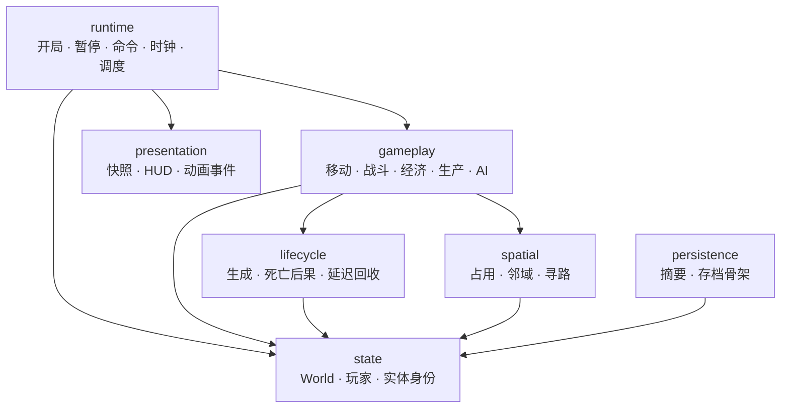

# ra-engine

一局 RTS 对局的运行时。本 crate 是仓库的 **仿真重心**：玩家与 AI 的意图以命令进入，按固定逻辑 tick 推进，持有权威状态，并导出供
UI、动画与渲染使用的只读快照。它不创建操作系统窗口，不初始化 GPU，不扫描用户磁盘上的安装目录——这些由 `ra-desktop` /
`ra-webui` 与 adaptor 在开局前完成。

若你正在查找「世界如何往前走」「命令如何被拒绝」「胜负如何判定」「HUD 资金从哪来」，答案应首先落在本包，而不是渲染器或桌面事件循环。

## 读者动线

1. 理解本包在整仓中的位置（下文「在仓库中的位置」）。
2. 弄清对外能力：开局、提交命令、推进 tick、暂停、取快照与摘要（「对外职责」）。
3. 再进入内部正交模块：runtime / state / spatial / gameplay / lifecycle / presentation / persistence。
4. 最后看测试入口与构建命令。



## 在仓库中的位置

桌面、测试与渲染器都依赖本 crate；本 crate 再依赖地图、适配投影、定义契约与（规划中的）通用 ECS 基础设施。



硬边界：

- **消费方不得**把 ECS 内部句柄、组件存储下标或 `World` 可变借用当作长期公开 API 扩散到 UI / 网络协议。
- **adaptor 不得**依赖本 crate；冻结定义经 `ra-definition`（及当前过渡中的 Rules 投影）单向流入。
- **渲染器不得**为了播动画去改权威生命值或占格；逻辑死亡与爆炸播放解耦。

## 对外职责

当前实现仍以会话型 API 为主（`Session` / `open_skirmish_session`、`GameCommand`、`RenderSnapshot`），理想形态正向「`Engine` /
`Match` + 稳定 `EntityId` 命令」收敛。无论类型名如何演进，对外能力集合保持不变：

| 能力            | 含义                                                   |
|-----------------|--------------------------------------------------------|
| 创建 / 打开对局 | 在已装载的规则与地图上建立权威状态                     |
| 提交命令        | 移动、攻击、部署、放置、生产、集结等；失败产生拒绝记录 |
| 推进逻辑时间    | `tick` / `pump`：固定频率，与重绘次数无关              |
| 暂停与恢复      | 手动暂停、胜负锁定、摘要不一致等                       |
| 呈现投影        | `snapshot`：单位、建筑、经济、队列、选中、动画提示     |
| 状态摘要        | 确定性哈希，供回归与未来锁步校验                       |

典型单机帧循环（壳层视角）：



## 内部模块

内部按两条轴组织： **执行机制**（何时推进、如何提交结构变更）与 **玩法领域**（移动、战斗、经济等语义）。目录表达归属；空文件或骨架模块表示预留位置，不等于该能力已完备。



```text
src/
  runtime/         对局生命周期、命令编解码、时钟与阶段、调度入口
  state/           权威 World、玩家资金与电力、实体运行时字段
  spatial/         寻路、占格相关辅助（邻域 / 占用索引继续加强）
  gameplay/        规则语义：战斗、经济、生产、AI、冻结规则辅助
  lifecycle/       生成、销毁后果、延迟回收（原「对象 GC」职责）
  presentation/    面向 UI / 动画 / 渲染的投影边界
  persistence/     确定性 rehash 与存档 / 恢复骨架
```

### runtime

决定一局何时开始、暂停、结束；把输入命令排进当前 tick；在固定顺序下调用各系统。AI 若启用，也只通过同一命令入口下发，不直接改写实体字段。

### state

保存唯一权威可变状态：实体列表（过渡期仍为集中结构体）、玩家经济、通行格、规则绑定结果等。地图静态信息来自 `ra-map`
装载结果；动态占用须与移动 / 生成 / 销毁一致更新。

### spatial

RTS 成本常在「附近有谁、如何到达」。本层承载寻路与占格相关逻辑，并预留邻域索引与寻路预算扩展点。应避免把「全表扫描 +
每次复制网格」当作长期方案。

### gameplay

能力如何交互：伤害步骤、矿场入账、工厂队列、部署映射、基础 AI 决策等。配置字段变成组件或字段只完成数据表达；语义必须写在系统里。

### lifecycle

区分「逻辑死亡 / 移出场景 / 释放存储」。战斗系统决定死亡后果并产生事件；回收在约定阶段统一提交，保证确定性，且不把爆炸动画播放完当作删除条件。

### presentation / persistence

快照与摘要是输出边界。摘要用于回归与未来联机校验；快照字段面向 HUD 与绘制，避免把整份规则文本每帧拷进渲染线程。

## 确定性与联机预备

- 固定系统顺序；同优先级决策使用稳定规则，不依赖查询遍历的偶然次序。
- 结构变更（生成、删组件、销毁）应走向统一提交阶段，避免在遍历中直接撕裂存储。
- 随机数只来自确定性来源（引入完整 RNG 流之后）。
- 逻辑 tick 与墙钟分离：`pump` 可用真实时间追帧，但游戏规则只认 tick。

## 与测试的关系

本包集成测试只有一个根：`tests/engine/main.rs`（Cargo 二进制名 `engine`）。其下按与 `src/` 相同的七轴用目录 + `mod.rs` 组织（`runtime` / `state` / `spatial` / `gameplay` / `lifecycle` / `presentation` / `persistence`），共用 `common`。不使用 `#[path]`，也不使用「同名 `axis.rs` + `axis/`」双轨。轴上预留模块不等于该能力测例已齐。

`ra-testing` 经本包的会话 / 命令 / tick 路径做无窗口回归。改 tick 顺序或摘要输入集时，必须同步更新测试期望。

目录塑形脚本：`scripts/reshape-engine-tests.mjs`（已落盘的仓库请直接在 `tests/engine/` 下增测，勿重复清空覆盖）。

## 构建

```shell
cargo test -p ra-engine
cargo test -p ra-testing
```

许可证：MPL-2.0。
