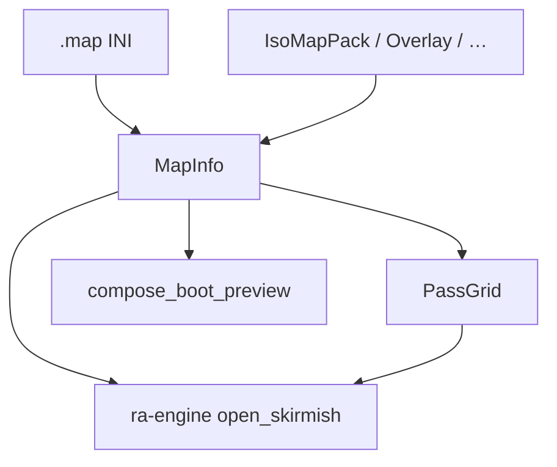
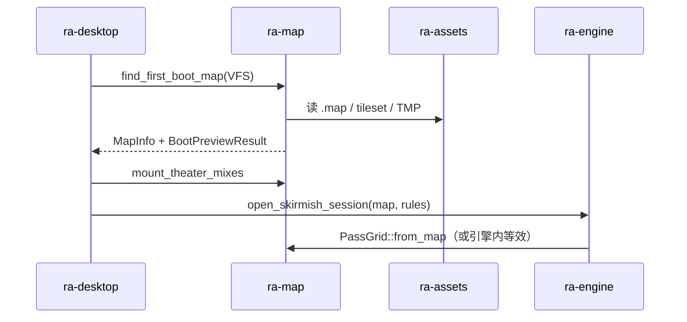
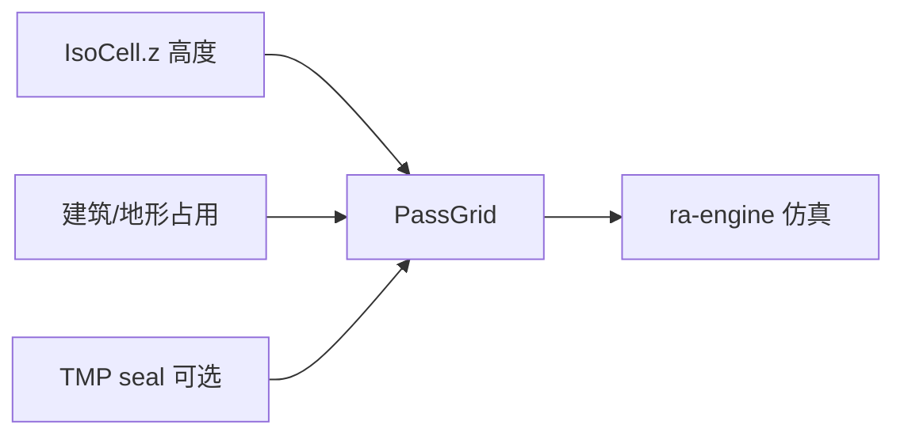
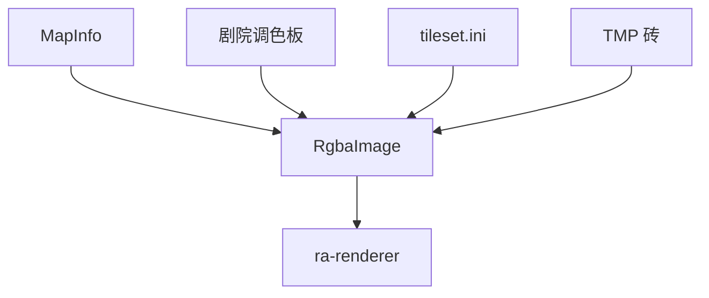

# ra-map

本 crate 管的是 **一张地图从 INI 与二进制段变成结构化 `MapInfo`、通行格网 `PassGrid` 与启动预览 RGBA** 的管道。输出供 **
`ra-engine`** 开局与世界引导使用，也供 `ra-desktop` 在 boot 阶段合成预览图。本 crate 没有 wgpu、没有 tick、不扫描安装目录。

依赖 `ra-types` 与 `ra-assets`（INI、PAL、SHP、TMP 等）。字节一律经 `AssetSource` 传入。



## 在仓库中的位置



桌面候选地图名由 `BOOT_MAP_CANDIDATES` 常量定义；本 crate 不硬编码「必须哪张图」，只提供「首个解析成功者胜出」的查找 API。

## 剧院（`Theater`）

| `Theater` | INI 别名       | 挂载 MIX                  | 调色板       |
|-----------|----------------|---------------------------|--------------|
| Temperate | TEMPERATE, TEM | `temperat.mix`, `tem.mix` | `isotem.pal` |
| Snow      | SNOW, SNO      | `snow.mix`, `sno.mix`     | `isosno.pal` |
| Urban     | URBAN, URB     | `urban.mix`, `urb.mix`    | `isourb.pal` |
| Lunar     | LUNAR, LUN     | `lunar.mix`, `lun.mix`    | `isolun.pal` |
| Desert    | DESERT, DES    | `desert.mix`, `des.mix`   | `isodes.pal` |

未知剧院字符串 → `RaError::Parse`。`theater_mix_names`、`theater_palette`、`theater_tmp_extension` 等助手供 boot 挂载与绘制路径使用。

## `MapInfo`：地图总线

```rust
pub struct MapInfo {
    pub edition: GameEdition,
    pub name: String,
    pub width: u32,
    pub height: u32,
    pub theater: Theater,
    pub cells: Vec<IsoCell>,
    pub overlays: Vec<OverlayCell>,
    pub terrain_objects: Vec<TerrainObject>,
    pub entities: Vec<MapEntity>,
    pub waypoints: Vec<Waypoint>,
    // …
}
```

### INI 解析（`parse_ini`）

1. `IniDocument::parse`
2. 读 `[Map]` 的 `Size`：`x,y,width,height`，取第 3、4 段为宽高
3. `Theater` 键缺省为 `"TEMPERATE"`
4. 尝试解 IsoMapPack； **失败则 `cells` 置空并仍返回 Ok**（元数据可用，地形格可选）

`empty(edition, name)` 提供占位：默认 Temperate、尺寸 0、无单元格。

## 二进制段解码

### IsoMapPack5（`iso_pack`）

```text
numbered_section_concat("IsoMapPack5")
  → base64_decode
  → lzo::decompress_chunks
  → 每 11 字节 → IsoCell { x, y, tile_num, sub_tile, z, flags }
  → 丢弃 x==0 && y==0 的填充记录
```

LZO 实现在本 crate 的 `lzo.rs`（含 M1–M4 与分块包装），不依赖外部 lzo crate。

### 覆盖层、地形物件、放置、航点

| 模块              | 段名 / 来源                    | 产出               |
|-------------------|--------------------------------|--------------------|
| `overlay`         | OverlayPack                    | `OverlayCell` 网格 |
| `terrain_objects` | `[TerrainTypes]` 等            | 静态树石等         |
| `placements`      | `[Units]` / `[Structures]` / … | `MapEntity`        |
| `waypoints`       | `[Waypoints]`                  | 出生点与标签       |

`LandType` 与 `ground_passable` 提供陆地类型语义，供通行与预览标记使用。

## `PassGrid`：通行格网

`PassGrid` 是矩形 **可走表 + 每格高度**，为 **`ra-engine`** 寻路、放置与爬升判定提供起步数据：



- **`PassGrid::open(w,h)`**：全可走、高度 0。
- **`from_map(map)`**：灌入 `IsoCell.z`，建筑与地形物件占用格设为不可走。
- **`MAX_GROUND_CLIMB`**：相邻格允许的最大高度差（与 TMP 粗对齐）。
- **`seal_pass_grid_from_tmp`**：用 TMP 高度进一步修正（预览/仿真一致化方向）。

引擎开局可持有 `PassGrid` 副本或等价结构；本 crate 不推进单位，只提供静态地图侧几何与占用信息。

## 预览合成

启动阶段桌面需要一张 RGBA 图交给 `ra-renderer::set_preview`，优先级在壳层编排，核心 API 在本 crate：

| API                                          | 作用                                     |
|----------------------------------------------|------------------------------------------|
| `compose_boot_preview`                       | 地图 + tileset + TMP + 调色板 → 整幅地形 |
| `compose_skirmish_preview`                   | 遭遇战布局预览（单位/建筑绘制统计）      |
| `compose_terrain_rgba`                       | 底层地形 blit 列表                       |
| `paint_map_structures` / `paint_map_mobiles` | 预放置实体精灵                           |
| `load_fallback_theater_tile`                 | 无完整 cells 时的单砖回退                |

`iso_math` 提供等距格与屏幕像素换算（`TILE_WIDTH` / `TILE_HEIGHT` / `HEIGHT_STEP`），预览与将来相机共用同一套数学约定。



预览是 **只读投影**；权威实体列表仍在 **`ra-engine`** 的 `World` 中创建与更新。

## 启动地图辅助

- **`find_first_boot_map`**：按候选名顺序在 VFS 中尝试 `try_parse_boot_map`。
- **`mount_theater_mixes`**：解析成功后挂载 `theater_mix_names` 列出的 MIX。
- **`BootMapResult`**：携带 `MapInfo` 与是否挂载剧院等信息。

## 源码布局

```
src/lib.rs           MapInfo 与再导出
src/theater.rs       剧院枚举与文件名
src/iso_pack.rs      IsoMapPack5
src/lzo.rs / base64.rs / lcw.rs
src/pass_grid.rs     通行格
src/compose.rs       地形 RGBA 合成
src/skirmish_preview.rs
src/boot_map.rs      启动候选
… terrain_paint / overlay_paint / structure_paint 等
```

## 构建与测试

```shell
cargo test -p ra-map
cargo build -p ra-map
```

地图与剧院 MIX 由用户自备；GPU 代码在 `ra-renderer`，对局逻辑在 **`ra-engine`**。

## 许可

MPL-2.0。
