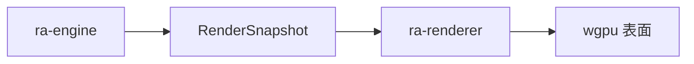
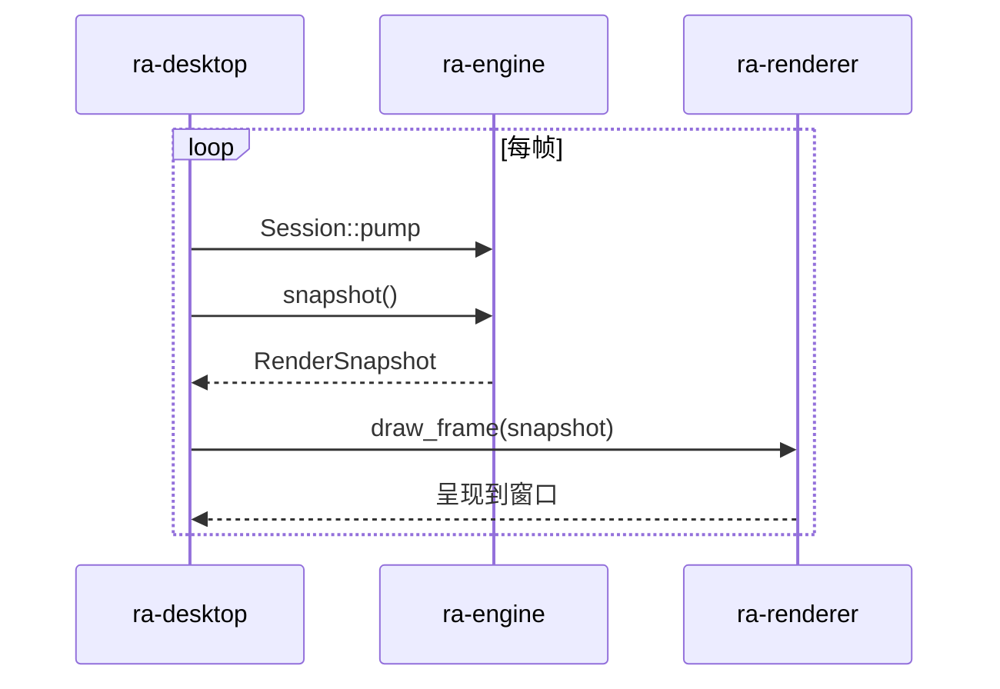
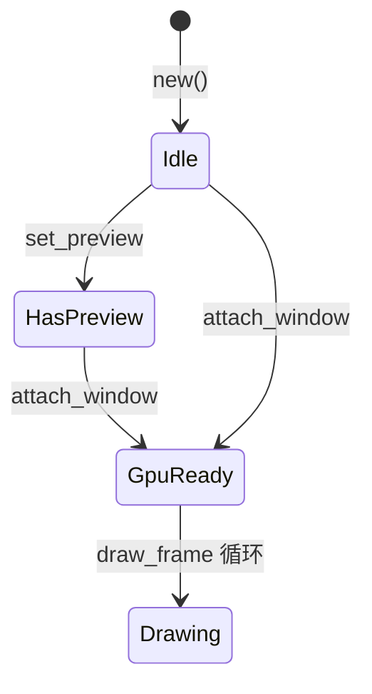
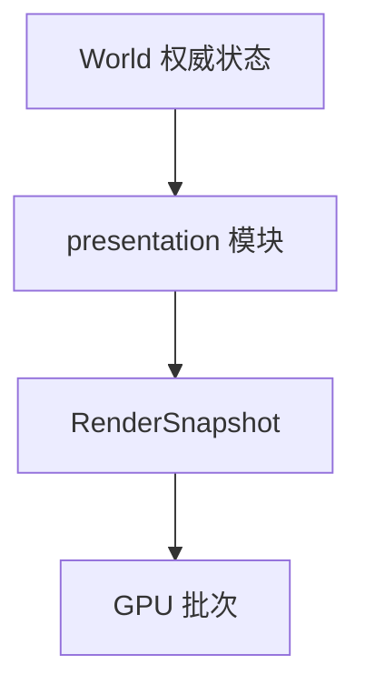

# ra-renderer

本 crate 负责 **读取 `ra-engine` 导出的呈现快照，经现代 GPU（wgpu）绘制到窗口或画布**。它是仿真与像素之间的最后一环： **只消费
`RenderSnapshot`，不修改权威世界状态，不解析 MIX，不实现 DirectDraw**。

产品定位是现代化重写：原生后端常见 DX12 / Vulkan / Metal；浏览器目标走 WebGL2 / WebGPU 方向（由 `ra-webui` 接线）。
**故意不**做 ddraw 兼容层，也 **不**向原版 `game.exe` 注入。

## 读者动线

1. 弄清渲染器与 **`ra-engine`** 的边界（快照进、像素出）。
2. 按调用顺序阅读 `Renderer` 生命周期。
3. 了解 `GpuContext` 与 wgpu 配置。
4. 理解当前预览精灵路径与未来批次扩展方向。
5. 构建与集成注意事项。



## 在仓库中的位置

桌面与 Web 壳共享同一呈现契约：引擎推进 tick 并导出快照；渲染器每帧绘制，不参与逻辑判定。



依赖：`ra-types`、`ra-engine`（仅快照与相关类型，不持有 `World` 可变引用）。

硬边界：

- **不得**为播动画去改生命值、占格或经济——逻辑死亡与视觉播放解耦。
- **不得**在本 crate 读盘或挂载 MIX。
- **不得**把整局地图 CPU 软件光栅当作唯一主路径（启动预览可以；主路径应走 GPU 批次）。

## `Renderer` 生命周期

| 方法                                  | 行为                                                  |
|---------------------------------------|-------------------------------------------------------|
| `new()`                               | 初始状态，无 GPU                                      |
| `set_preview(RgbaImage)`              | 设置启动预览图；若 GPU 已附着则立即上传纹理           |
| `attach_window(Arc<Window>)`          | 创建 `GpuContext` 与 swapchain；若有 preview 则建精灵 |
| `resize(w, h)`                        | 更新表面配置，宽高至少 1                              |
| `draw_frame(Option<&RenderSnapshot>)` | 清屏 + 可选精灵 + 帧计数                              |
| `backend_name()`                      | 当前 wgpu 后端标签                                    |
| `has_preview()`                       | 是否持有预览纹理                                      |
| `backend_hint()`                      | 固定 `"wgpu"`，供诊断                                 |

典型顺序：`set_preview`（boot 解码出的 SHP/地形图）→ `attach_window`（winit `resumed`）→ 循环 `draw_frame`。顺序反了也可工作：附着时会补建
sprite。



## `GpuContext`（`gpu.rs`）

- **后端**：`Backends::PRIMARY`（平台优选 DX12 / Vulkan / Metal / GL）。
- **电源**：`HighPerformance`。
- **表面**：优先 sRGB 格式；`PresentMode::Fifo`；`desired_maximum_frame_latency: 2`。
- **标签**：设备与队列字符串带 `ra.` 前缀，便于 RenderDoc 等工具过滤。
- **初始化**：原生路径用 `pollster::block_on` 同步创建；Wasm 异步分支待 `ra-webui` 接线。

`backend_label` 映射示例：`wgpu/dx12`、`wgpu/vulkan`、`wgpu/metal`、`wgpu/gl`、`wgpu/webgpu`。

清屏色常量（接近夜间战术图，非最终 UI 主题）：

```rust
const CLEAR_COLOR: wgpu::Color = {
    r: 0.04, g: 0.06, b: 0.09, a: 1.0
};
```

## 当前绘制能力

模块划分：

```
src/lib.rs         Renderer 状态机
src/gpu.rs         适配器 / 设备 / 表面
src/rgba_image.rs  CPU RGBA 校验
src/sprite.rs      单纹理四边形 + WGSL
```

**今日能画**：深色清屏 + 可选一张居中放大（ **4×** 最近邻）的预览精灵。快照中的 tick、单位列表等字段供后续批次与 HUD
使用；主绘制路径仍以 boot 预览纹理为主。

### 精灵管线（`sprite.rs`）

- 采样：最近邻（像素风）。
- 混合：标准 alpha。
- 格式：`Rgba8UnormSrgb`。
- 顶点按表面尺寸居中；每帧 `write_vertices` 更新。
- WGSL：`vs_main` / `fs_main`，`textureSample`。

`RgbaImage::new` 校验 `pixels.len() == width * height * 4` 且尺寸非零，失败时桌面跳过该预览候选。

## 与 `RenderSnapshot` 的耦合

`RenderSnapshot` 由 **`ra-engine`** 的 presentation 层导出，包含单位精灵、选中框、经济 HUD 元素等只读投影（随版本演进字段会增加）。渲染器：

1. 读取快照中的 drawable 列表（未来：地形批次、VXL 层、UI 图集）。
2. 按深度/层排序提交 wgpu render pass。
3. **不**回写引擎状态。



标题栏上的 tick 由桌面从 `Session` 读取；渲染器可选读快照内冗余字段做帧内插值（尚未启用）。

## 演进方向

合理扩展入口（非 DirectDraw 移植）：

| 模块方向     | 消费数据                     |
|--------------|------------------------------|
| `terrain.rs` | `ra-map` 单元格 + TMP 实例化 |
| `units.rs`   | VXL 光栅 + HVA 帧            |
| `ui.rs`      | SHP 图集与字体               |

每增加一类 drawable，应新增 wgpu pipeline 与 bind group 布局，而不是继续把所有内容塞进单张 `SpriteGpu`。

## 构建

```shell
cargo build -p ra-renderer
```

无默认 GPU 单元测试（需物理适配器；CI 未接 wgpu 测试）。本地验证请运行 `ra-desktop` 观察 `ra2 gpu: …` 日志。

Wasm：`ra-webui` 未来将传入 canvas 并调用 `attach_window` 的 Web 变体；当前 `gpu.rs` 尚未分出
`cfg(target_arch = "wasm32")` 分支。

## 许可

MPL-2.0。
