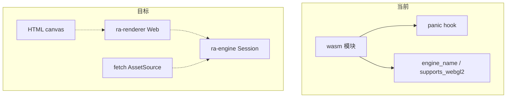
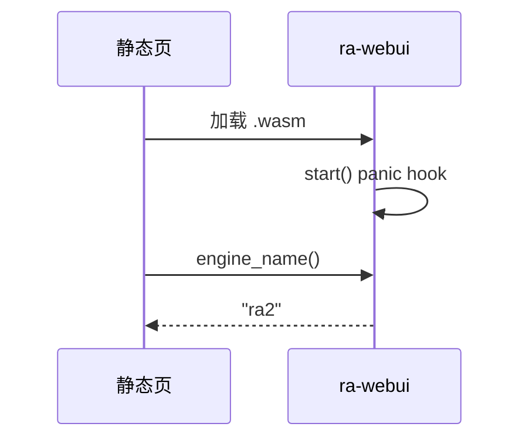
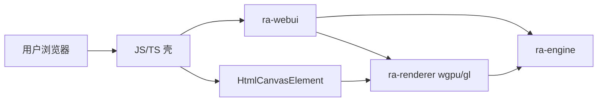

# ra-webui

浏览器侧 **Wasm 壳**（`crate-type = ["cdylib", "rlib"]`）。本 crate 占位未来「在网页中驱动 **`ra-engine`** 对局、经 WebGL2
方向呈现 `RenderSnapshot`」的导出边界。当前实现仍是 **最小占位**：三个 `wasm_bindgen` 函数，尚未创建 canvas、未调用
`ra-renderer`、未实现 fetch 版 `AssetSource`。

`publish = false`。日常原生开发走 `ra-desktop`；本包保证工作区拓扑在浏览器目标上不必从零接线。



## 与 `ra-desktop` 对照

| 能力                   | `ra-desktop` | 本 crate（现状 → 目标）      |
|------------------------|--------------|------------------------------|
| 读 `config.toml`       | 有           | 无 → 页面配置 / URL 参数     |
| 探测安装 / 挂载 MIX    | 有           | 无 → 用户选目录或 CDN 字节包 |
| winit + wgpu 表面      | 有           | 无 → canvas + wgpu Web       |
| `Session::pump` / 快照 | 有           | 无 → **接入 ra-engine**      |
| `draw_frame`           | 有           | 无 → **接入 ra-renderer**    |
| Wasm 导出              | 无           | 有（占位三函数）             |

桌面路径：配置 → adaptor → MIX → **`open_skirmish_session`** → pump → `RenderSnapshot` → wgpu。  
Web 路径目标相同，仅 I/O 与表面创建不同； **仿真重心仍在 `ra-engine`**，不在 JS 层复刻规则。

## 当前导出

源码整文件职责：

| 导出              | 行为                                                      |
|-------------------|-----------------------------------------------------------|
| `start`           | `#[wasm_bindgen(start)]`：安装 `console_error_panic_hook` |
| `engine_name`     | 恒返回 `"ra2"`                                            |
| `supports_webgl2` | 画布未接线前恒 `false`；**不是**浏览器探测 |

没有创建 `<canvas>`，没有初始化 wgpu 实例，没有构造对局运行时。



`Cargo.toml` 已声明 `ra-types`、`ra-engine`、`ra-renderer` 依赖，供后续接线；`lib.rs` 尚未 `use`。工作区 `web-sys` 亦待列入本包
manifest。

## 目标架构（WebGL2 方向）



计划步骤（尚未实现）：

1. **页面**提供 canvas 与输入事件（指针、键盘）。
2. **`ra-webui`** 创建 wgpu 表面（WebGL2 或 WebGPU 后端），调用 `Renderer::attach_window` 的 Wasm 变体。
3. **资源**：实现 `AssetSource`——例如 `fetch("/assets/ra2.mix")` 或用户通过 File System Access API 选择的文件；字节进入现有
   `MixVfs` / 解析链， **不**重写 INI/MIX 逻辑。
4. **对局**：`open_skirmish_session` + 每帧 `pump` + `snapshot` + `draw_frame`，与桌面事件循环同构，只是时钟来自
   `requestAnimationFrame`。
5. **联机（Beta）**：与 `ra-net` 共用命令序列化，WebSocket 由 JS 或 Rust 侧接入。

渲染器 crate 头注释已声明 Wasm 走 WebGL2；`gpu.rs` 原生路径用 `pollster::block_on`，Wasm 需异步 `request_adapter` 分支，将与本
crate 一同落地。

## 资源与合规

浏览器无法假定本地 `C:/Games/RA2` 路径。合法数据来源示例：

- 用户自行选择已购买安装目录中的文件（File API）。
- 站点托管经授权的资源包（需权利链清晰）。
- 开发阶段的小体积合成夹具（不含原版 MIX 进 git）。

`AssetSource::read(relative) -> RaResult<Vec<u8>>` 契约不变，`ra-adaptor` / `ra-map` / `ra-assets` 可复用，Web 不必分叉解析器。

## 页面侧约定（接线前）

即便引擎尚未挂 canvas，页面已经可以：

1. 加载本包打出的 wasm。
2. 调用 `engine_name()` 确认标识为 `"ra2"`。
3. 读取 `supports_webgl2()`——画布未接线前为 `false`；生产环境仍须在 JS 侧真实检测 WebGL2/WebGPU，不能仅依赖本导出。

`start` 的 panic hook 只改善 Rust panic 可读性，不替代页面自己的错误 UI。

## 构建

工具链：仓库根 `rust-toolchain.toml`（nightly）。

```shell
cargo build -p ra-webui
```

交叉编译 wasm32 需安装对应 target 与 `wasm-bindgen-cli` / `wasm-pack`；仓库内暂无附带 `index.html` 或打包脚本，以本地前端工程为准。

典型打包流程（示意）：

```shell
rustup target add wasm32-unknown-unknown
cargo build -p ra-webui --target wasm32-unknown-unknown --release
# 再用 wasm-bindgen 生成 JS 胶水
```

失败信息以 rustc / wasm-bindgen 输出为准。

## 依赖清单

- `ra-types`、`ra-engine`、`ra-renderer`（预留）
- `wasm-bindgen`
- `console_error_panic_hook`

无 feature 开关。

## 许可

MPL-2.0。浏览器部署同样要求使用者自行提供合法游戏数据来源；本仓库不附带原版 MIX、音频或地图。
