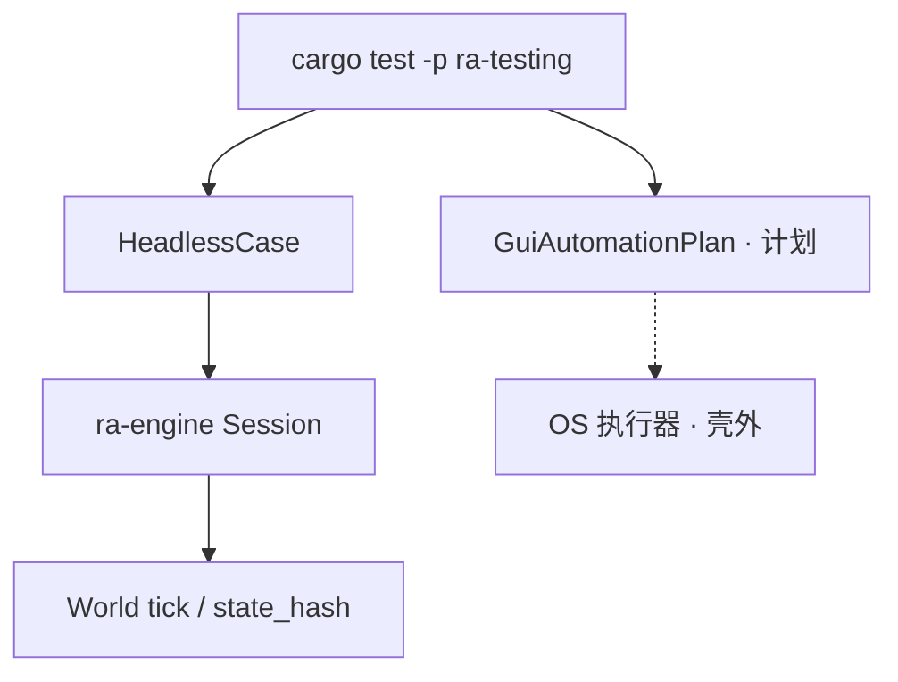
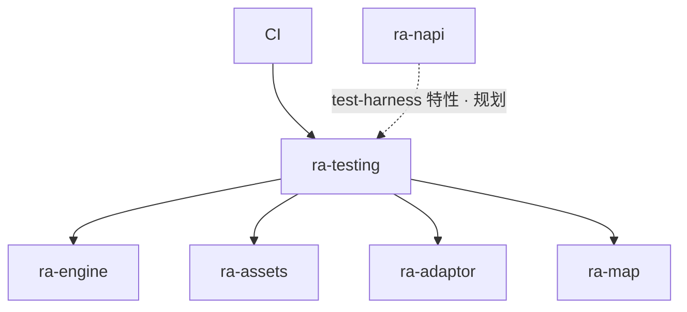
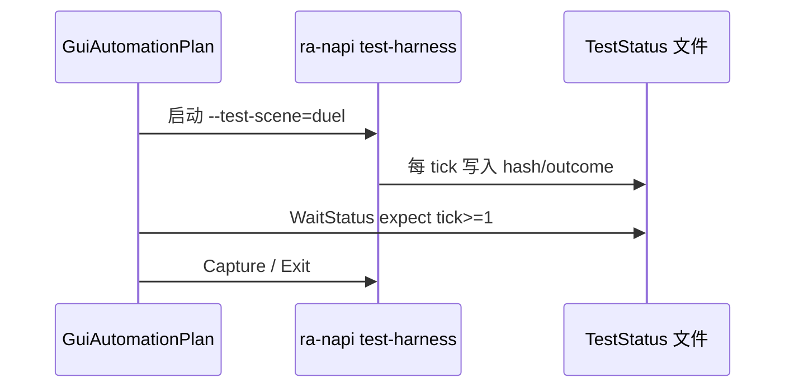
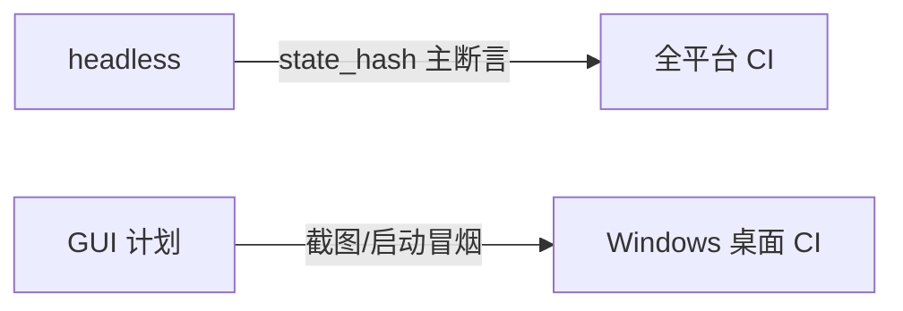

# ra-testing

`ra-testing` 是 **测试支撑 crate**：提供无窗口 headless 遭遇战夹具、冻结 Alpha 竖切数据、GUI 自动化 **计划模型**与测试状态旁路解析。它
**不是**游戏运行时， **不包含**原版游戏资源，且 **`publish = false`**（不发布到 crates.io）。

核心原则： **测试必须与产品走同一条路**——通过 `ra-engine` 的 `Session`、`GameCommand` 与 `Session::tick`
推进，而不是复制一份简化仿真。Headless 用例不创建窗口、不初始化 wgpu、不读取用户安装目录。

## 它是什么

RTS 引擎的质量依赖三类验证：

| 层次          | 本 crate 提供                      | 断言依据                                       |
|---------------|------------------------------------|------------------------------------------------|
| Headless 逻辑 | `HeadlessCase`、`standard_duel` 等 | `state_hash`、`BattleOutcome`、`RenderSnapshot` |
| 冻结竖切      | `alpha_skirmish_v1`                | 建筑/单位/经济常量清单                         |
| GUI 自动化    | `GuiAutomationPlan`                | 窗口标题、截图基线、`TestStatus` 旁路          |

Headless 是 **世界正确性的权威来源**。GUI 自动化用于「壳层 + GPU + 输入栈」冒烟与回归截图； **不能以渲染帧数或像素 alone
证明仿真正确**——仍应以 headless 摘要为准。



**Non-goals**：不替代 `ra-engine` 单元测试；不在 CI 默认路径启动真实 `ra-napi`（除非独立带桌面作业）；不分发可玩二进制。

## 在仓库中的位置



- **`ra-engine`** 持有权威仿真；本 crate 是 **消费者**，封装夹具与观测 API。
- **`ra-napi`** 正常依赖图 **不**应依赖 `ra-testing`。GUI 执行器应位于测试工具或 `--features test-harness` 隔离路径。
- **Workspace 成员** 可在 `tests/` 或 `dev-dependencies` 引用本 crate（若 policy 允许）。

仿真重心不变： **一局 match runtime** 在 `ra-engine` 内 owns 命令、固定 tick 与 snapshots。`ra-testing` 只缩短「构造一局 + 跑
N tick + 断言」的样板代码。

## 如何使用

### Headless 标准坦克决斗

```rust
use ra_testing::{HeadlessCase, standard_duel};
use ra_engine::GameCommand;

let mut case = standard_duel();
case.command(GameCommand::/* ... */);
case.advance(120);
let obs = case.observe();

assert!(obs.tick >= 120);
assert_eq!(obs.state_hash, expected_hash); // 回归基线
```

`standard_duel()` 构造 **合成**规则与地图：两名玩家、各一辆 `MTNK`，是 `alpha-skirmish-v1` 竖切的 **最小战斗前身**
，用于命令、移动、攻击、胜负与确定性回归。

### MCV 部署与经济夹具

```rust
use ra_testing::{mcv_deploy_open, yard_open, ai_skirmish_open};

let case = mcv_deploy_open(); // 盟军 MCV + 冻结初始资金
// 或 yard_open / ai_skirmish_open 等专用开局
```

完整竖切建筑、采矿、生产见 `alpha_skirmish_v1()` 与对应 integration tests（`tests/produce.rs`、`tests/ore_income.rs` 等）。

### 观测结构 `HeadlessObservation`

| 字段         | 含义                                        |
|--------------|---------------------------------------------|
| `tick`       | 当前世界逻辑 tick                           |
| `state_hash` | `World::state_hash()`                       |
| `outcome`    | 若已结束，`BattleOutcome`                    |
| `snapshot`   | `RenderSnapshot`（无 GPU 也可检查实体列表） |

`HeadlessCase::command` 在下一 `tick` 前入队；`advance` 精确推进指定 tick 数，遇 `outcome` 提前停止。无墙钟、无事件泵。

### Alpha 竖切冻结数据

```rust
use ra_testing::{alpha_skirmish_v1, ALPHA_SKIRMISH_SLICE_ID, AlphaSkirmishSlice};

let slice: AlphaSkirmishSlice = alpha_skirmish_v1();
assert_eq!(slice.slice_id, ALPHA_SKIRMISH_SLICE_ID);
// slice.buildings / slice.units / starting_funds / ore_income_per_trip ...
```

竖切 ID 为 `"alpha-skirmish-v1"`。`SliceBuildingRole`、`SliceUnitRole` 标注建筑/单位职能，供测试与引擎开发对齐「Alpha
单机一局」范围，而不绑定真实地图文件路径。

### GUI 自动化计划（模型阶段）

```rust
use ra_testing::{GuiAutomationPlan, standard_duel_gui_plan};

let plan: GuiAutomationPlan = standard_duel_gui_plan();
// plan.actions: WaitForWindow, Click, Key, Capture, WaitStatus, Exit ...
// plan.expectations: WindowTitleContains, ScreenshotMatches, StatusMatches ...
```

`GuiAction` / `GuiExpectation` **平台无关**；Windows 第一版执行器应使用 UI Automation，在 **带桌面会话的 CI 作业**运行，独立於
`ra-napi` 主 binary。

`TestStatus` 解析 `RA2_TEST_STATUS_PATH` 旁路文件（`tick` / `hash` / `outcome` / `selected` / `difficulty` / `screen` 等键），供 GUI 测试轮询引擎状态而无需
OCR HUD。`TestStatus::wait_until` 按 `matches_expect` 轮询直至超时，可直接承接 `GuiAction::WaitStatus`（例如 `screen=results` / `leave_armed=true`）。



截图基线须固定：窗口尺寸、GPU 后端、字体缩放、合成内容目录、测试时钟。变更任一条件应更新基线或只跑 headless。

Pre-Alpha 关键页截图基线名见 `pre_alpha_acceptance_capture_names()`（计划骨架见
`pre_alpha_acceptance_capture_plan`）。仅真实屏幕名，不含 hover / 色块假图。
原版 UI 接线后用 GPU `Capture` 对照；勿再导出色块菜单 PNG。

### 在 workspace 测试中依赖

```toml
[dev-dependencies]
ra-testing = { path = "../ra-testing" }
```

或直接运行本 crate 测试：

```shell
cargo test -p ra-testing
```

## 内部设计

### 模块划分

| 模块          | 导出                                      | 职责                |
|---------------|-------------------------------------------|---------------------|
| `headless`    | `HeadlessCase`, `standard_duel`, …        | 合成 `Session` 夹具 |
| `alpha_slice` | `alpha_skirmish_v1`, `AlphaSkirmishSlice` | 冻结竖切常量        |
| `gui`         | `GuiAutomationPlan`, `GuiAction`, …       | GUI 测试 DSL        |
| `status`      | `TestStatus`                              | 旁路文件解析        |

Headless 夹具在内部构造最小 `IniDocument`、`RulesDb`、`MapInfo` 与实体列表，逻辑与 `ra-engine` tests 共享同一
`open_skirmish_session` 或等价路径，避免「测试版 World」。

### 确定性约定

- 固定规则文本与地图尺寸；
- 禁用非确定性 AI 随机（或使用固定 seed 的 AI 路径）；
- 同一命令脚本 + 同一夹具 → `state_hash` 稳定，供 CI 回归。

当引擎 intentionally 变更行为时，应更新 hash 基线并注明原因（在 commit message 中说明行为变化，而非在本 readme 写内部里程碑代号）。

### GUI 与 headless 分工



世界规则、经济、战斗： **只信 headless**。GUI 验证「能启动、能点、能出图、能退出」。

### 演进方向

1. 用 `alpha_skirmish_v1` 驱动 MCV → 建造 → 采矿 → 生产 headless 剧本，逐步扩展 `tests/`；
2. `ra-napi` 增加 `test-harness` feature：`--test-scene`、`RA2_TEST_SCENE`、`RA2_TEST_STATUS_PATH`；
3. 实现 Windows GUI 执行器；
4. CI：headless 全平台，GUI 独立作业。

## 构建与测试

```shell
cargo test -p ra-testing
cargo test -p ra-testing --test headless_duel
cargo test -p ra-testing --test ai_skirmish_victory
```

本 crate 依赖 `ra-engine`，编译时间随引擎增长。本地开发可 `-p ra-testing` 缩小范围。失败时优先检查 `state_hash`
漂移是引擎行为变化还是夹具脚本错误。

```shell
cargo check -p ra-testing
```

**不发布**：`Cargo.toml` 中 `publish = false`，外部项目不应依赖 crates.io 上的 `ra-testing`。

## 许可证

本 crate 采用 **Apache-2.0**。内置 INI 与地图数据为 **合成测试夹具**，不包含 Westwood / EA 原版资源。请勿将本 crate
与商业游戏文件打包分发。
