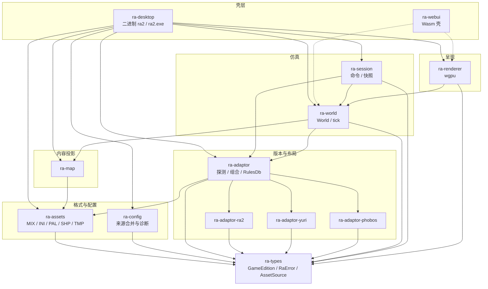

# ra2

跨平台 GUI 引擎，用于在玩家自备的《命令与征服：红色警戒 2》、《尤里的复仇》以及心灵终结 3（Mental Omega 3）数据上运行自有逻辑。

本仓库是 **现代化重写**：原生入口由 `ra-desktop` 产出二进制 **`ra2`**（Windows 上为 `ra2.exe`），渲染走 **wgpu**（桌面常见后端为
DX12 / Vulkan / Metal；浏览器目标走 WebGL2 方向的 `ra-webui`）。 **不是** DirectDraw 兼容层， **不是**向原版 `game.exe` /
`gamemd.exe` 注入。

仓库 **不包含**原版 MIX / INI / 音频 / 地图等资源文件。运行前请自行准备合法取得的游戏安装目录。

---

## 架构总览

按依赖方向分层：下层不知道窗口与 GPU；壳层负责配置、目录与事件循环。


虚线表示 `ra-webui` 已在清单中依赖相关 crate，但当前导出仍是占位（详见 [
`projects/ra-webui/README.md`](projects/ra-webui/README.md)）。`ra-adaptor-phobos` 是心灵终结 3（Mental Omega 3）资源表，经 `ra-adaptor` 按 `GameEdition::Mo3` 装配。

### Crate 依赖关系（简化）

```mermaid
flowchart LR
    types[ra-types]
    ra2a[ra-adaptor-ra2]
    yra[ra-adaptor-yuri]
    mo3[ra-adaptor-phobos]
    ad[ra-adaptor]
    as[ra-assets]
    cf[ra-config]
    mp[ra-map]
    wo[ra-world]
    se[ra-session]
    re[ra-renderer]
    de[ra-desktop]
    we[ra-webui]
    ra2a --> types
    yra --> types
    mo3 --> types
    ad --> types
    ad --> as
    ad --> ra2a
    ad --> yra
    ad --> mo3
    as --> types
    cf --> types
    mp --> types
    mp --> as
    wo --> types
    wo --> ad
    wo --> mp
    se --> types
    se --> wo
    se --> mp
    se --> ad
    re --> types
    re --> se
    de --> ad
    de --> cf
    de --> as
    de --> mp
    de --> se
    de --> wo
    de --> re
    we --> types
    we --> wo
    we --> re
```---

## 原生启动数据流

`cargo run -p ra-desktop` 时，大致顺序如下（细节见 [`projects/ra-desktop/README.md`](projects/ra-desktop/README.md)）：

```mermaid
sequenceDiagram
    participant User as 用户
    participant Cfg as ra-config
    participant Desk as ra-desktop
    participant Ad as ra-adaptor
    participant Vfs as MixVfs
    participant Map as ra-map
    participant World as ra-world
    participant Gpu as ra-renderer
    User ->> Desk: 启动 ra2
    Desk ->> Cfg: 合并桌面设置
    Cfg -->> Desk: ra2_dir / edition
    Desk ->> Ad: detect_edition
    Ad -->> Desk: EditionManifest + ResourceChain
    loop 根 MIX
        Desk ->> Vfs: mount_bytes
    end
    loop 嵌套 MIX
        Desk ->> Vfs: mount_nested
    end
    Desk ->> Map: 解析启动地图 / 剧院
    Desk ->> Vfs: 挂载剧院 MIX
    Desk ->> Desk: 生成预览 RGBA
    Desk ->> Ad: load_rules_chain
    Ad -->> Desk: RulesDb
    Desk ->> World: World::new via Session boot
    Desk ->> Gpu: attach_window / set_preview
    loop 每帧
        Desk ->> Desk: Session::tick
        Desk ->> Gpu: draw_frame
    end
```
原版与尤里的复仇共用同一套内核类型与流水线；差异集中在 adaptor 资源表（文件名）以及玩家目录里的数据内容。

---

## 仓库布局

```text
ra2.exe/                 工作区根（本 README）
├── Cargo.toml           workspace；默认成员 ra-desktop
├── rust-toolchain.toml  nightly
├── License.md           MPL-2.0
└── projects/
    ├── ra-types/
    ├── ra-adaptor/ · ra-adaptor-ra2/ · ra-adaptor-yuri/ · ra-adaptor-phobos/
    ├── ra-assets/
    ├── ra-config/
    ├── ra-map/
    ├── ra-world/
    ├── ra-session/
    ├── ra-renderer/
    ├── ra-desktop/      → 二进制 ra2
    └── ra-webui/        → cdylib Wasm 壳
```

每个 crate 目录下有独立 `README.md`，说明该包的模块、公开 API 与现状。

---

## 配置

在 **运行时的工作目录**放置 `config.toml` 或 `ra2.toml`：

```toml
ra2_dir = "C:/path/to/your/ra2"
edition = "ra2"
```

| 键                     | 说明                                                                     |
|------------------------|--------------------------------------------------------------------------|
| `ra2_dir` / `game_dir` | 含零售 MIX、INI 的游戏目录                                               |
| `edition`              | `ra2` 或 `yr`（另支持若干别名，见 `ra-types`）；省略则按目录特征自动探测 |

若目录同时具备原版与尤里的复仇特征，自动探测会报歧义，此时必须显式写明 `edition`。

解析器是桌面壳内的极简键值读取（够启动即可），不是完整 TOML 实现。

---

## 构建与运行

工具链以根目录 `rust-toolchain.toml` 为准（ **nightly**，含 `rustfmt` / `clippy`）。

```shell
# 原生 GUI（默认成员）
cargo run -p ra-desktop
# 等价
cargo run

# 常用库测试（格式与地图管线）
cargo test -p ra-assets -p ra-map

# 无窗口探针示例（需本机游戏目录；参数为目录路径）
cargo run -p ra-desktop --example probe_boot -- "C:/path/to/your/ra2"
```

浏览器目标：`ra-webui`（Wasm / WebGL2 方向）。当前导出为占位符号，画布与资源加载尚未接线；构建与现状见该 crate README。

Release 配置（工作区 `Cargo.toml`）启用较高优化、LTO、符号剥离与 `panic = "abort"`，适合分发二进制；日常开发用默认 debug 即可。

---

## Crate 一览

| Crate            | 作用                                                           | 文档                                        |
|------------------|----------------------------------------------------------------|---------------------------------------------|
| `ra-types`       | 基类型：`GameEdition`、`RaError`、`AssetSource`、`Fixed16`、ID | [README](projects/ra-types/README.md)       |
| `ra-adaptor`     | 版本探测、组合适配、`ResourceChain`、`RulesDb` 装载            | [README](projects/ra-adaptor/README.md)     |
| `ra-adaptor-ra2` | 原版资源表                                                     | [README](projects/ra-adaptor-ra2/README.md) |
| `ra-adaptor-yuri`  | 尤里的复仇资源表                                               | [README](projects/ra-adaptor-yuri/README.md)  |
| `ra-adaptor-phobos` | Phobos / MO 布局资源表                                     | [README](projects/ra-adaptor-phobos/README.md) |
| `ra-assets`      | Westwood 格式与 INI 派生表：MIX / INI / 调色 / Techno 等       | [README](projects/ra-assets/README.md)      |
| `ra-config`      | 配置来源合并与诊断                                             | [README](projects/ra-config/README.md)      |
| `ra-map`         | 地图 / 剧院 / IsoMapPack / TMP 索引                            | [README](projects/ra-map/README.md)         |
| `ra-world`       | 确定性世界句柄：`World`、tick、`GameCommand`、`state_hash` | [README](projects/ra-world/README.md)       |
| `ra-session`     | 共享会话：命令转发与 `RenderSnapshot`                       | —                                          |
| `ra-renderer`    | wgpu 呈现                                                     | [README](projects/ra-renderer/README.md)    |
| `ra-renderer`    | wgpu 渲染（不实现 DirectDraw）                                 | [README](projects/ra-renderer/README.md)    |
| `ra-desktop`     | 原生 GUI 壳 → **`ra2` / `ra2.exe`**                            | [README](projects/ra-desktop/README.md)     |
| `ra-webui`       | Wasm 壳                                                        | [README](projects/ra-webui/README.md)       |

---

## 设计要点

- **共内核**：`GameEdition` 区分原版与尤里的复仇；仿真与渲染尽量版本无关，差异落在资源表与数据文件。
- **I/O 边界**：解析器只吃字节（`AssetSource` / `MixVfs`）；文件系统与窗口留在壳层。
- **现代 GPU**：呈现路径基于 wgpu；不把 DirectDraw / 原版 exe 注入作为主路径。
- **可测格式层**：`ra-assets`、`ra-map` 带合成数据单元测试；完整启动验证需自备游戏目录。

---

## 许可与数据

- 引擎源代码： **MPL-2.0**（[`License.md`](License.md)）。
- 游戏资源：由用户自行提供；请确保你有权使用对应安装文件。
- 作者信息见各 `Cargo.toml` 的 `authors` 字段。
