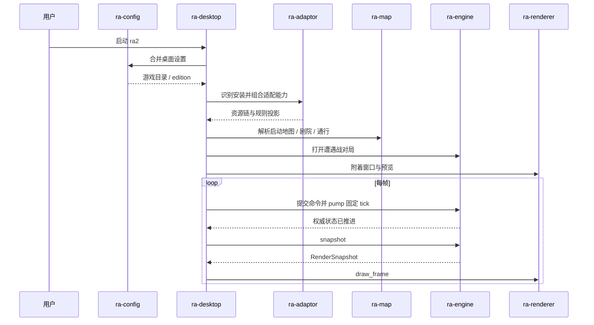
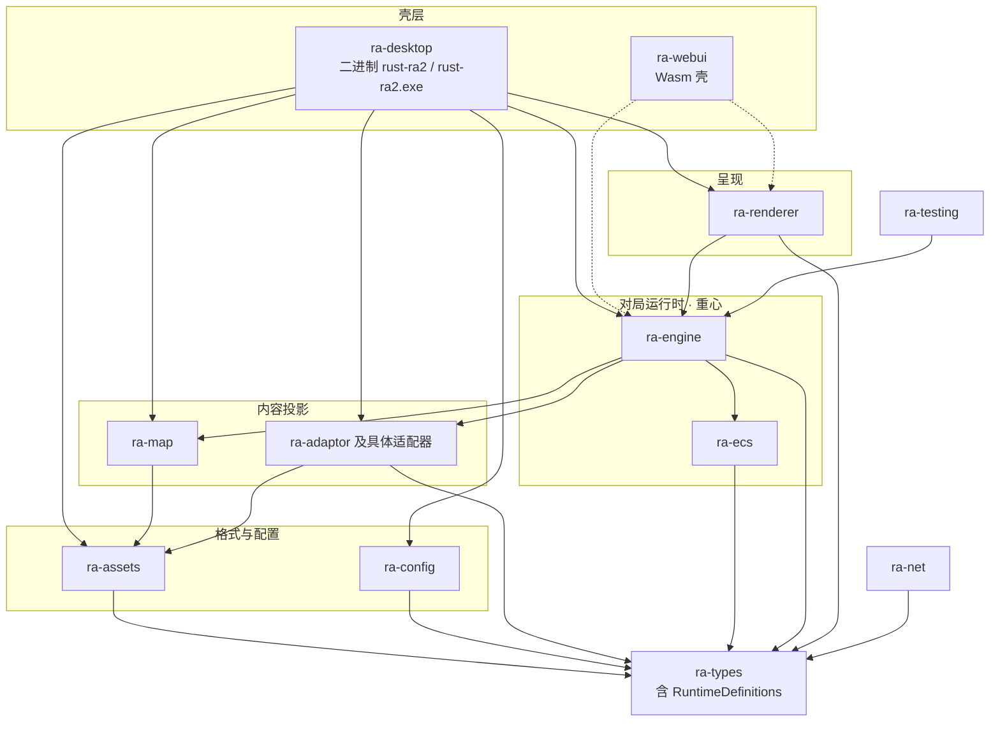
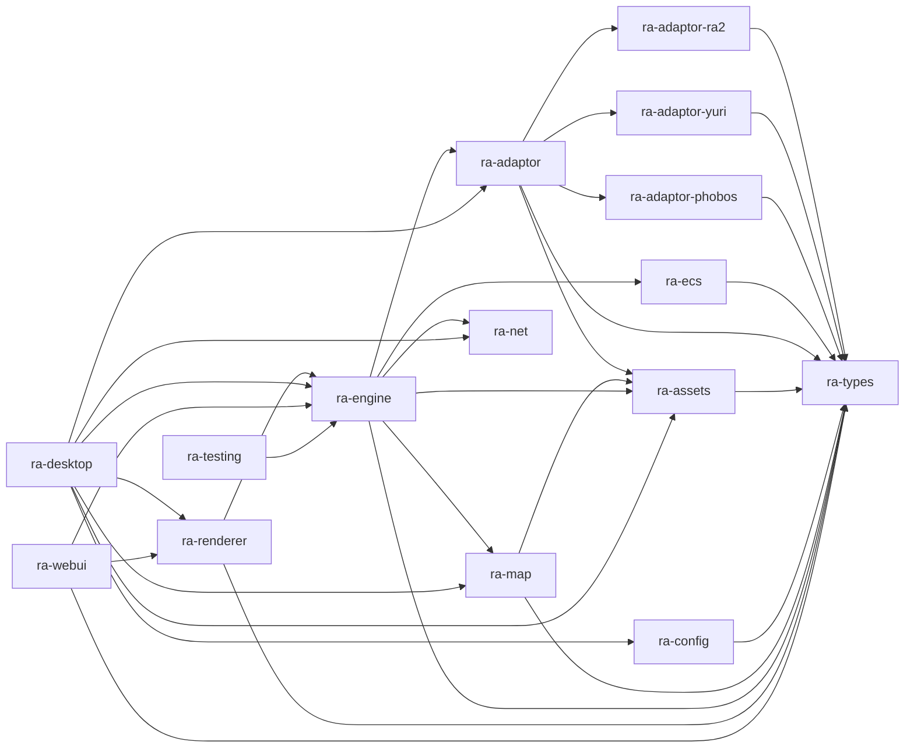

# ra2

跨平台 GUI 引擎，用于在玩家自备的《命令与征服：红色警戒 2》、《尤里的复仇》以及心灵终结 3（Mental Omega 3）数据上运行自有逻辑。

本仓库是 **现代化重写**：原生入口由 `ra-desktop` 产出二进制 **`rust-ra2`**（Windows 上为 `rust-ra2.exe`），对局由 **`ra-engine`**
推进，呈现走现代 GPU API（桌面常见 DX12 / Vulkan / Metal；浏览器目标走 WebGL2 方向的 `ra-webui`）。 **不是** DirectDraw 兼容层，
**不是**向原版 `game.exe` / `gamemd.exe` 注入。

仓库 **不包含**原版 MIX / INI / 音频 / 地图等资源文件。运行前请自行准备合法取得的游戏安装目录。

从配置与构建开始，再往下看启动与架构：准备数据与配置 → 构建运行 → 理解启动时发生了什么 → 再看以 `ra-engine` 为重心的分层与各
crate 文档。

---

## 准备游戏数据与配置

在 **可执行文件同目录**放置 `RustAlert.toml`，用于分辨率、显示与其它启动选项。模板见 `RustAlert.toml.example`。

默认情形：未配置 `ra2_dir` 时，取 exe 所在目录。因此把 `rust-ra2` / `rust-ra2.exe` 放进游戏安装目录即可定位资源，无需再写安装路径；**不等于**可以不提供本配置文件。

```toml
# 仅当 exe 不在游戏目录内时需要显式写出
ra2_dir = "C:/path/to/your/ra2"
edition = "ra2"
```

| 键                     | 说明                                                                     |
|------------------------|--------------------------------------------------------------------------|
| `ra2_dir` / `game_dir` | 含零售 MIX、INI 的游戏目录；省略则为 exe 同目录                          |
| `edition`              | `ra2` 或 `yr`（另支持若干别名，见 `ra-types`）；省略则按目录特征自动探测 |

若目录同时具备原版与尤里的复仇特征，自动探测会报歧义，此时须显式写明 `edition`。配置由 `toml_edit` 读写（可保留注释），模板见仓库根目录 `RustAlert.toml.example`。

---

## 构建与运行

工具链以根目录 `rust-toolchain.toml` 为准（ **nightly**，含 `rustfmt` / `clippy`）。

```shell
# 原生 GUI（默认成员）→ 产出 rust-ra2 / rust-ra2.exe
cargo run -p ra-desktop
# 等价
cargo run

# 对局与资源相关回归
cargo test -p ra-assets -p ra-map -p ra-engine -p ra-testing

# 无窗口探针示例（需本机游戏目录；参数为目录路径）
cargo run -p ra-desktop --example probe_boot -- "C:/path/to/your/ra2"
```

浏览器目标：`ra-webui`（Wasm / WebGL2 方向）。当前导出为占位符号，画布与资源加载尚未接线；构建与现状见该 crate README。

Release 配置（工作区 `Cargo.toml`）启用较高优化、LTO、符号剥离与 `panic = "abort"`，适合分发二进制；日常开发用默认 debug 即可。

---

## 原生启动时发生了什么

`cargo run -p ra-desktop` 时，壳层先完成配置与内容装载，再把对局交给 **`ra-engine`**，每帧只向引擎要快照交给渲染器。细节见 [
`projects/ra-desktop/readme.md`](projects/ra-desktop/readme.md) 与 [
`projects/ra-engine/readme.md`](projects/ra-engine/readme.md)。



原版与尤里的复仇共用同一套引擎与呈现流水线；差异集中在 adaptor 资源表以及玩家目录里的数据内容。

---

## 架构总览（重心：`ra-engine`）

对局权威状态与固定 tick 推进集中在 **`ra-engine`**。壳层负责配置、目录与事件循环；渲染只消费引擎导出的快照；测试经同一命令与
tick 路径回归。



`ra-engine` 内部按 runtime / state / spatial / gameplay / lifecycle / presentation / persistence 划分，详见引擎 README。

虚线表示 `ra-webui` 已在清单中依赖相关 crate，但当前导出仍是占位。`ra-testing` 只服务测试，不被产品 crate 依赖。

### Crate 依赖关系（简化）



---

## 仓库布局

```text
ra2.exe/                 工作区根（本 README）
├── Cargo.toml           workspace；默认成员 ra-desktop
├── rust-toolchain.toml  nightly
├── License.md           MPL-2.0
├── scripts/             仓库内开发用脚本
└── projects/
    ├── ra-types/        → 基类型 + RuntimeDefinitions
    ├── ra-ecs/
    ├── ra-adaptor/ · ra-adaptor-ra2/ · ra-adaptor-yuri/ · ra-adaptor-phobos/
    ├── ra-assets/
    ├── ra-config/
    ├── ra-map/
    ├── ra-engine/       → 一局对局运行时（重心）
    ├── ra-net/
    ├── ra-testing/      → headless / GUI 计划（非运行时）
    ├── ra-renderer/
    ├── ra-desktop/      → 二进制 rust-ra2
    └── ra-webui/        → cdylib Wasm 壳
```

每个 crate 目录下有独立 `readme.md`，说明该包职责与现状。建议先读 `ra-engine` 与 `ra-desktop`，再按启动链路下钻 adaptor /
map / assets / renderer。

---

## Crate 一览

| Crate               | 作用                                                 | 文档                                           |
|---------------------|------------------------------------------------------|------------------------------------------------|
| `ra-types`          | 基类型 + 冻结 `RuntimeDefinitions`（全体层共同语言） | [readme](projects/ra-types/readme.md)          |
| `ra-ecs`            | 通用实体/组件存储与结构变更（无 RTS 语义）           | [readme](projects/ra-ecs/readme.md)            |
| `ra-assets`         | Westwood 格式与 INI 派生表                           | [readme](projects/ra-assets/readme.md)         |
| `ra-config`         | 配置来源合并与诊断                                   | [readme](projects/ra-config/readme.md)         |
| `ra-map`            | 地图 / 剧院 / 通行与预览装配                         | [readme](projects/ra-map/readme.md)            |
| `ra-adaptor`        | 版本探测、组合适配、资源链与规则投影                 | [readme](projects/ra-adaptor/readme.md)        |
| `ra-adaptor-ra2`    | 原版资源表                                           | [readme](projects/ra-adaptor-ra2/readme.md)    |
| `ra-adaptor-yuri`   | 尤里的复仇资源表                                     | [readme](projects/ra-adaptor-yuri/readme.md)   |
| `ra-adaptor-phobos` | Phobos / MO 布局资源表                               | [readme](projects/ra-adaptor-phobos/readme.md) |
| `ra-engine`         | **一局对局：命令、固定 tick、权威状态、呈现快照**    | [readme](projects/ra-engine/readme.md)         |
| `ra-net`            | 联机协议无关基础类型（Beta 接入点）                  | [readme](projects/ra-net/readme.md)            |
| `ra-testing`        | headless 夹具与 GUI 自动化计划（非运行时）           | [readme](projects/ra-testing/readme.md)        |
| `ra-renderer`       | 呈现（只消费引擎快照）                               | [readme](projects/ra-renderer/readme.md)       |
| `ra-desktop`        | 原生 GUI 壳 → **`rust-ra2` / `rust-ra2.exe`**                  | [readme](projects/ra-desktop/readme.md)        |
| `ra-webui`          | Wasm 壳                                              | [readme](projects/ra-webui/readme.md)          |

---

## 设计要点

- **共享内核**：版本与扩展差异尽量落在 adaptor 与数据；仿真与呈现共用 `ra-engine` / `ra-renderer`。
- **I/O 边界**：解析器只吃字节（`AssetSource` / 资源挂载）；文件系统与窗口留在壳层。
- **现代 GPU**：呈现路径基于现代图形 API；不把 DirectDraw / 原版 exe 注入作为主路径。
- **可测运行时**：`ra-testing` 经 `ra-engine` 做无窗口确定性回归；完整启动验证需自备游戏目录。

---

## 许可与数据

- 引擎源代码： **MPL-2.0**（[`License.md`](License.md)）。
- 游戏资源：由用户自行提供；请确保你有权使用对应安装文件。
