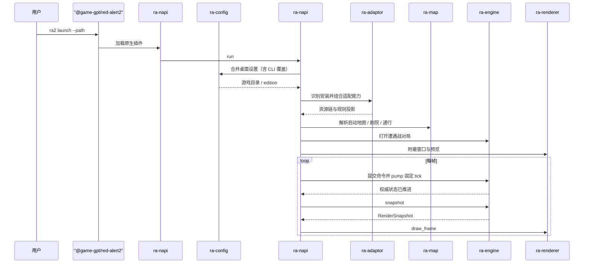
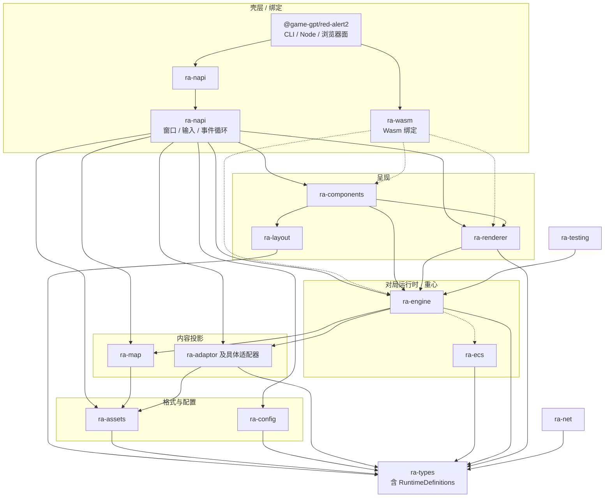
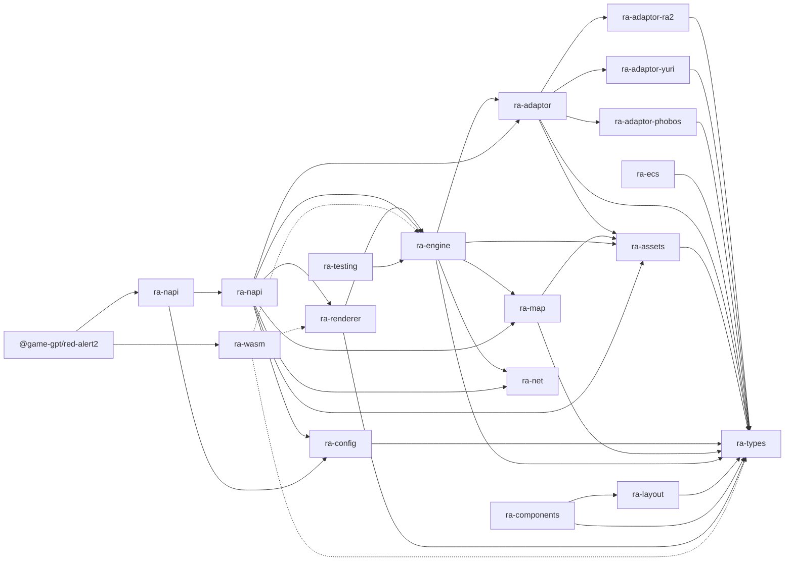

# ra2

跨平台 GUI 引擎，用于在玩家自备的《命令与征服：红色警戒 2》、《尤里的复仇》以及心灵终结 3（Mental Omega 3）数据上运行自有逻辑。

本仓库是 **现代化重写**：产品入口为 npm 包 **`@game-gpt/red-alert2`**（CLI `ra2 launch --path`），经 N-API 拉起原生窗口实现 `ra-napi`；对局由 **`ra-engine`**
推进，呈现走现代 GPU API（桌面常见 DX12 / Vulkan / Metal；浏览器目标走 WebGL2 方向的 `ra-wasm`）。**不是** DirectDraw 兼容层，
**不是**向原版 `game.exe` / `gamemd.exe` 注入。

仓库 **不包含**原版 MIX / INI / 音频 / 地图等资源文件。运行前请自行准备合法取得的游戏安装目录。

从安装启动与配置开始，再往下看开发构建与架构：准备数据与配置 → 安装 / 构建运行 → 理解游戏如何执行 → 再看以 `ra-engine` 为重心的分层与各
crate 文档。

---

## 安装与启动

```bash
npm i -g @game-gpt/red-alert2
# 合集盘 / 同时有 game.exe 与 gamemd.exe 时必须显式指定版本，否则可能落到 YR 资源链
ra2 launch --path "C:/Games/RA2" --edition ra2
ra2 launch --path "C:/Games/YR" --edition yr
```

`--path` 指向含零售 MIX/INI 的安装根目录。壳层 UI 当前以 **RA2** 资源链对照为主；混装安装请始终加 `--edition ra2`。

---

## 准备游戏数据与配置

也可在工作目录放置 `RustAlert.toml`，用于分辨率、显示与其它启动选项。模板见 `RustAlert.toml.example`。
若启动时尚无该文件，程序会自动生成一份默认配置以便持久化。**CLI `--path` 优先于**其中的 `ra2_dir`。

```toml
# 仅当未用 CLI --path、且工作目录不在游戏安装根内时需要显式写出
ra2_dir = "C:/path/to/your/ra2"
edition = "ra2"
```

| 键                     | 说明                                                                     |
|------------------------|--------------------------------------------------------------------------|
| `ra2_dir` / `game_dir` | 含零售 MIX、INI 的游戏目录；CLI `--path` 覆盖此项                        |
| `edition`              | `ra2` 或 `yr`（另支持若干别名，见 `ra-types`）；省略则按目录特征自动探测 |

若目录同时具备原版与尤里的复仇特征，自动探测会报歧义，此时须显式写明 `edition`（或 CLI `--edition`）。配置由 `toml_edit` 读写（可保留注释）。

---

## 开发构建

工具链以根目录 `rust-toolchain.toml` 为准（ **nightly**，含 `rustfmt` / `clippy`）。JS 侧用 pnpm workspace。

```shell
pnpm install
pnpm run build
pnpm exec ra2 --help

# 对局与资源相关回归
cargo test -p ra-assets -p ra-map -p ra-engine -p ra-testing

# 资源查证：用 extract / unpack，不要再写一次性 Rust 探针
pnpm exec ra2 extract --path "C:/Games/RA2" --edition ra2 --out ./tmp/extract --decode-shp -- sdtp.shp title.pcx
pnpm exec ra2 unpack --path "C:/Games/RA2" --edition ra2 --out ./tmp/unpack
pnpm exec ra2 unpack --path "C:/Games/RA2" --edition ra2 --out ./tmp/unpack --names-file ./extra_names.txt

# 仅调试原生壳（非资源探针）：需 RustAlert.toml 或默认目录
cargo run -p ra-napi --example launch

pnpm run lint
pnpm run fmt
```

浏览器路径：`ra-wasm` → `@game-gpt/red-alert2-unknown-wasm32`，再由 `@game-gpt/red-alert2` 的 `./wasm` 面整合。当前导出为占位符号，画布与资源加载尚未接线；构建与现状见该 crate README。

Release 配置（工作区 `Cargo.toml`）启用较高优化、LTO、符号剥离与 `panic = "abort"`，适合分发原生插件；日常开发用默认 debug 即可。

npm 正式发布走 GitHub Actions **Trusted Publisher**（OIDC），工作流文件固定为 `.github/workflows/publish-npm.yml`，环境名 `NPM_PUBLISH`。推送 `v*` 标签（或手动 `workflow_dispatch`）后：先编齐四平台 native，再等待同提交的 `ci.yml` 全绿，然后编 wasm / TypeScript，最后按「平台包 → wasm → `@game-gpt/red-alert2`」顺序发布。本地一般不要 `npm publish`。

---

## 游戏如何执行

桌面经 `@game-gpt/red-alert2` → `ra-napi` → `ra-napi`；浏览器经同一 host 的 `./wasm` 面 → `ra-wasm`（当前占位）。两条壳层都把对局权威状态交给 **`ra-engine`**：装载配置与内容后打开会话，每帧提交命令、`pump` 固定 tick，再取 `RenderSnapshot` 交给 `ra-renderer`。细节见 [
`projects/bindings/ra-napi/readme.md`](projects/bindings/ra-napi/readme.md) 与 [
`projects/engine/ra-engine/readme.md`](projects/engine/ra-engine/readme.md)。



原版与尤里的复仇共用同一套引擎与呈现流水线；差异集中在 adaptor 资源表以及玩家目录里的数据内容。

---

## 架构总览（重心：`ra-engine`）

对局权威状态与固定 tick 推进集中在 **`ra-engine`**。npm 包 `@game-gpt/red-alert2` 同时依赖原生绑定 `ra-napi` 与浏览器绑定 `ra-wasm`；壳层负责配置、目录与事件循环；渲染只消费引擎导出的快照；测试经同一命令与
tick 路径回归。



`ra-engine` 内部按 runtime / state / spatial / gameplay / lifecycle / presentation / persistence 划分，详见引擎 README。

虚线表示下游尚未完全接线：`ra-wasm` → 引擎 / 渲染仍是占位；`ra-ecs` 已存在但尚未被 `ra-engine` 依赖；`ra-layout` / `ra-components` 已落骨架，壳层 UI 尚未迁入。`ra-testing` 只服务测试，不被产品 crate 默认依赖。

### Crate / 包依赖关系（简化）



---

## 仓库布局

```text
ra2.exe/                 工作区根（本 README）
├── Cargo.toml           Rust workspace；默认成员 ra-napi
├── package.json         pnpm workspace 根
├── rust-toolchain.toml  nightly
├── License.md           Apache-2.0
├── scripts/             构建 / 发布脚本
└── projects/
    ├── engine/          ra-types … ra-layout / ra-components / ra-renderer / ra-net
    ├── adapters/        ra-adaptor*
    ├── bindings/        ra-napi · ra-napi · ra-wasm
    ├── tooling/         ra-testing（后续 ra-modder）
    ├── hosts/           red-alert2（@game-gpt/red-alert2）
    ├── platforms/       native / wasm 平台包
    └── sites/           homepage / playground
```

每个 crate 目录下有独立 `readme.md`，说明该包职责与现状。建议先读 `ra-engine` 与 `ra-napi`，再按启动链路下钻 adaptor /
map / assets / renderer。

---

## Crate / 包一览

| 包 / Crate          | 作用                                                 | 文档                                                           |
|---------------------|------------------------------------------------------|----------------------------------------------------------------|
| `@game-gpt/red-alert2` | CLI + Node API + 浏览器面                         | [README](projects/hosts/red-alert2/README.md)                  |
| `ra-napi`           | N-API 绑定（供 host 加载）                           | —                                                              |
| `ra-napi`        | 原生窗口 / 输入 / 事件循环（仅供 `ra-napi`）         | [readme](projects/bindings/ra-napi/readme.md)               |
| `ra-wasm`           | Wasm 绑定（占位）                                    | [readme](projects/bindings/ra-wasm/readme.md)                  |
| `ra-types`          | 基类型 + 冻结 `RuntimeDefinitions`（全体层共同语言） | [readme](projects/engine/ra-types/readme.md)                   |
| `ra-ecs`            | 通用实体/组件存储与结构变更（无 RTS 语义）           | [readme](projects/engine/ra-ecs/readme.md)                     |
| `ra-assets`         | Westwood 格式与 INI 派生表                           | [readme](projects/engine/ra-assets/readme.md)                  |
| `ra-config`         | 配置来源合并与诊断                                   | [readme](projects/engine/ra-config/readme.md)                  |
| `ra-map`            | 地图 / 剧院 / 通行与预览装配                         | [readme](projects/engine/ra-map/readme.md)                     |
| `ra-adaptor`        | 版本探测、组合适配、资源链与规则投影                 | [readme](projects/adapters/ra-adaptor/readme.md)               |
| `ra-adaptor-ra2`    | 原版资源表                                           | [readme](projects/adapters/ra-adaptor-ra2/readme.md)           |
| `ra-adaptor-yuri`   | 尤里的复仇资源表                                     | [readme](projects/adapters/ra-adaptor-yuri/readme.md)          |
| `ra-adaptor-phobos` | Phobos / MO 布局资源表                               | [readme](projects/adapters/ra-adaptor-phobos/readme.md)        |
| `ra-engine`         | **一局对局：命令、固定 tick、权威状态、呈现快照**    | [readme](projects/engine/ra-engine/readme.md)                  |
| `ra-layout`         | UI 空间求解（约束 → `LayoutSnapshot`；骨架）         | [readme](projects/engine/ra-layout/readme.md)                  |
| `ra-components`     | UI 组件与画面组合（骨架；不直调 wgpu）               | [readme](projects/engine/ra-components/readme.md)              |
| `ra-net`            | 联机协议无关基础类型（Beta 接入点）                  | [readme](projects/engine/ra-net/readme.md)                     |
| `ra-testing`        | headless 夹具与 GUI 自动化计划（非运行时）           | [readme](projects/tooling/ra-testing/readme.md)                |
| `ra-renderer`       | 呈现（只消费引擎快照）                               | [readme](projects/engine/ra-renderer/readme.md)                |

---

## 设计要点

- **共享内核**：版本与扩展差异尽量落在 adaptor 与数据；仿真与呈现共用 `ra-engine` / `ra-renderer`；菜单布局与组件为 `ra-layout` / `ra-components`（壳层逐步迁入）。
- **I/O 边界**：解析器只吃字节（`AssetSource` / 资源挂载）；文件系统与窗口留在壳层。
- **现代 GPU**：呈现路径基于现代图形 API；不把 DirectDraw / 原版 exe 注入作为主路径。
- **可测运行时**：`ra-testing` 经 `ra-engine` 做无窗口确定性回归；完整启动验证需自备游戏目录。

---

## 许可与数据

- 引擎源代码： **Apache-2.0**（[`License.md`](License.md)）。
- 游戏资源：由用户自行提供；请确保你有权使用对应安装文件。
